# Data Science Questions and Answers

> **How to use this file**
> * Every answer has the same parts: steps, a diagram, a real-world example and code.
> * Code under **Python Code Example** runs as pasted, and the output shown below it is the real output. Three examples need extra infrastructure and say so (Kafka in Q3, Spark in Q4 and Q7).
> * Code under **Core Implementation Snippet** (Q13–Q20) is copied from the matching script, `13.py` to `20.py`. Run the script for the full program.
> * The code runs in conda environments. The table below says which one.

| Run this | In this conda environment | How the extra libraries were installed |
|---|---|---|
| Examples in Q1–Q12 (except Q10), and `13.py`, `14.py`, `16.py` to `20.py` | `ai_workspace` | `conda install -n ai_workspace fastapi uvicorn` (needed for Q5) |
| `15.py` (TensorFlow) | `tf_env` | already installed |
| The MLflow example in Q10 | `mlflow_env` | `conda create -n mlflow_env python=3.14 mlflow scikit-learn` |

MLflow has its own environment because installing it into `ai_workspace` would downgrade pandas. The Kafka hookup in Q3 and the Spark examples in Q4 and Q7 need a Kafka server and PySpark, which are not installed.

---

## 1. Handling Missing Data (30% missing)
**Question:** Imagine you're given a dataset where 30% of the data for a key predictive variable is missing. The variable is crucial for your predictive model. How would you handle this situation to ensure the integrity and performance of your model? Please describe your approach step by step.

**Answer:**
Deleting 30% of the rows throws away too much data, and filling the gaps carelessly distorts the variable. I would follow these steps:

**Step 1: Identify the Gaps**
Use `df.isnull().mean()` to see what share of each column is missing.

**Step 2: Analyze the Pattern**
Ask *why* the value is missing, because that decides which fix is safe:
* **Random** (e.g. a sensor dropped readings by chance): any sensible fill works.
* **Depends on other columns** (e.g. older houses have no recorded size): use those columns to fill it.
* **Depends on the missing value itself** (e.g. high earners hide their income): no fill is trustworthy. Talk to the data owner and keep a "was missing" flag.

**Step 3: Choose an Imputation Strategy**
* **Basic:** fill with the mean/median using `SimpleImputer`. Fast, but replacing 30% of a column with one number flattens it.
* **Advanced (Recommended):** predict the missing values from the other columns with **KNN** (`KNNImputer`) or **MICE** (`IterativeImputer`).
* **No imputation:** tree models such as `HistGradientBoostingRegressor`, XGBoost and LightGBM accept missing values directly.
* **Always add an indicator column** (`add_indicator=True`). The fact that a value was missing is often predictive.

**Step 4: Evaluate the Impact**
This is the most crucial step. Compare the strategies by **cross-validated model score**, and plot the column before and after filling to check that the fill did not create an unnatural spike.

**🔥 Pro Tip / Common Pitfall (Data Leakage):**
Never fit an imputer on the whole dataset before splitting it, because the test rows would then influence the training data. Put the imputer inside a scikit-learn `Pipeline`: it is then fitted on the training rows only, in every cross-validation fold.

**Visual Diagram:**
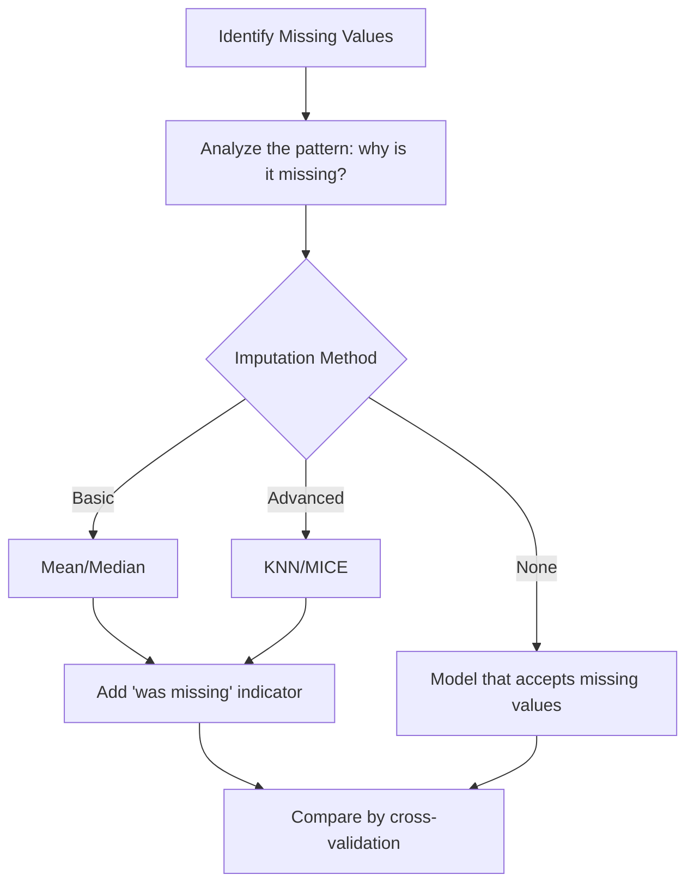

**Example:**
A housing dataset has no size for 30% of the houses, mostly the older ones. Filling every gap with the average size puts a spike in the middle of the histogram and tells the model that a 1-bedroom flat and a 5-bedroom house are the same size. KNN instead estimates each missing size from the bedrooms and age of similar houses.

**Python Code Example:**
```python
import numpy as np
import pandas as pd
from sklearn.ensemble import HistGradientBoostingRegressor
from sklearn.impute import KNNImputer, SimpleImputer
from sklearn.linear_model import LinearRegression
from sklearn.model_selection import cross_val_score
from sklearn.pipeline import make_pipeline
from sklearn.preprocessing import StandardScaler

# Sample data: 2,000 houses. Size drives the price and is linked to the number of bedrooms.
rng = np.random.default_rng(42)
bedrooms = rng.integers(1, 6, 2000)
age = rng.integers(0, 60, 2000)
size = 450 * bedrooms + rng.normal(0, 200, 2000)
price = 150 * size - 800 * age + rng.normal(0, 20000, 2000)
df = pd.DataFrame({'bedrooms': bedrooms, 'age': age, 'size': size})

# Remove about 30% of 'size'. Older houses lose it more often, so it is NOT missing at random.
df.loc[rng.random(2000) < np.where(age > 30, 0.45, 0.15), 'size'] = np.nan

# Step 1: Identify the gaps (share of missing values per column)
print(df.isnull().mean().round(2).to_dict())

# Step 2: Analyze the pattern - is 'size' missing more often for houses older than 30 years?
print(df['size'].isnull().groupby(df['age'] > 30).mean().round(2).to_dict())

# Steps 3 and 4: Try each strategy and let cross-validation judge.
# The imputer sits INSIDE the pipeline, so it is fitted on the training folds only (no leakage).
strategies = {
    'Drop the column': LinearRegression(),
    'Mean + indicator': make_pipeline(SimpleImputer(strategy='mean', add_indicator=True), LinearRegression()),
    'KNN + indicator': make_pipeline(StandardScaler(), KNNImputer(n_neighbors=5, add_indicator=True), LinearRegression()),
    'Model handles NaN': HistGradientBoostingRegressor(random_state=42),
}
for name, model in strategies.items():
    X = df.drop(columns='size') if name == 'Drop the column' else df
    score = cross_val_score(model, X, price, cv=5, scoring='r2').mean()
    print(f"{name:18s} R2 = {score:.3f}")
```

**Output:**
```text
{'bedrooms': 0.0, 'age': 0.0, 'size': 0.29}
{False: 0.15, True: 0.45}
Drop the column    R2 = 0.870
Mean + indicator   R2 = 0.885
KNN + indicator    R2 = 0.931
Model handles NaN  R2 = 0.922
```

KNN gives the best score here (R² 0.931), and the plain mean is barely better than dropping the column (0.885 against 0.870). On your data the ranking may differ, which is why you measure instead of assuming.

---

## 2. Handling Overfitting
**Question:** You've developed a predictive model, but you suspect it might be overfitting the training data. How would you test and address this issue? Please explain your steps and the techniques you would use.

**Answer:**
Overfitting happens when a model memorizes the training data, including its noise, instead of learning the underlying pattern. It then performs poorly on new, unseen data.

**Step 1: Test for Overfitting**
Split the data into training, validation and test sets, or use **k-fold cross-validation**. If accuracy is high on the training data but much lower on the validation data, the model is overfitting.

**Step 2: Address Overfitting (Regularization & Early Stopping)**
Simplify the model: limit tree depth, add penalties (L1/L2 regularization), reduce the number of features, or get more training data. For deep learning, **Early Stopping** (halt training when the validation error starts to rise) and Dropout are critical.

**Step 3: Confirm the Fix**
The goal is a **higher validation score**, not only a smaller gap. A model can have a small gap and still be bad (underfitting). Keep a change only if the validation score improves.

**Visual Diagram:**
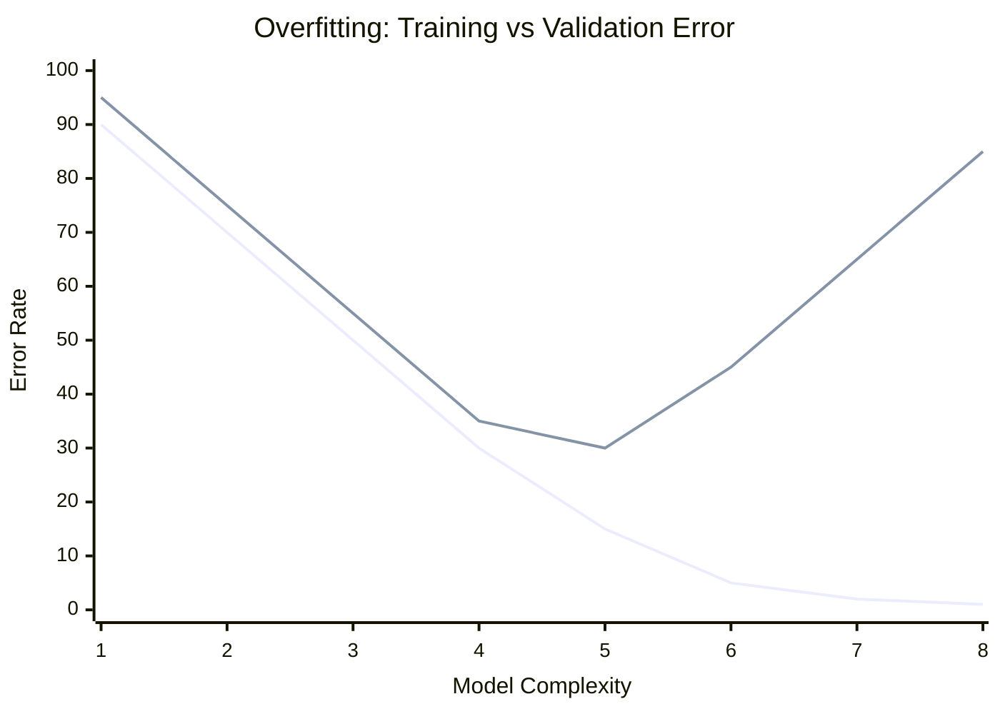
*(The gap between training and validation error grows as complexity grows: this is overfitting.)*

**Example:**
A student who memorizes the exact questions of a practice test scores 100% on it and fails the real exam. In practice: a churn model built with 500 features on 2,000 customers scores 99% in training and far less on next month's customers. Keeping only the most useful features lowers the training score and raises the score on new customers.

**Python Code Example:**
```python
from sklearn.datasets import make_classification
from sklearn.model_selection import cross_val_score, train_test_split
from sklearn.tree import DecisionTreeClassifier

# Noisy data: some labels are wrong, like real-world labelling mistakes
X, y = make_classification(n_samples=2000, n_features=20, n_informative=5, flip_y=0.2, random_state=42)
X_train, X_test, y_train, y_test = train_test_split(X, y, test_size=0.2, random_state=42)

# Step 1: Test for overfitting - compare accuracy on training data with accuracy on unseen data
# Step 2: Address it - limit how deep the tree may grow, then compare again
for name, max_depth in [('No depth limit', None), ('max_depth=4', 4)]:
    model = DecisionTreeClassifier(max_depth=max_depth, random_state=42).fit(X_train, y_train)
    train_acc = model.score(X_train, y_train)
    test_acc = model.score(X_test, y_test)
    cv_acc = cross_val_score(model, X_train, y_train, cv=5).mean()
    print(f"{name:15s} train={train_acc:.2f}  test={test_acc:.2f}  gap={train_acc - test_acc:.2f}  5-fold CV={cv_acc:.2f}")
```

**Output:**
```text
No depth limit  train=1.00  test=0.70  gap=0.30  5-fold CV=0.72
max_depth=4     train=0.81  test=0.77  gap=0.04  5-fold CV=0.76
```

Limiting the depth lowers training accuracy (1.00 to 0.81) but raises test accuracy (0.70 to 0.77): the tree stopped memorizing noise.

---

## 3. Real-time Stock Prediction System
**Question:** You are tasked with building a model to predict stock prices in real-time. The data comes in every second and you need to update your predictions accordingly. Describe how you would set up your system to handle this type of data effectively. What tools and techniques would you use, and why?

**Answer:**
The data arrives every second, so the system must do three things continuously and in well under a second: take in ticks, update the features, and refresh the prediction.

**Step 1: Ingestion**
Use **Apache Kafka** as the message queue. Why: it absorbs bursts of data, lets several programs read the same stream, and can replay old data for testing.

**Step 2: Stream Processing & Features**
Use **Apache Flink** (or Spark Structured Streaming) to keep a small rolling window per stock in memory: the last few price moves, moving averages, traded volume. Why: features must be computed per stock, on the fly, in milliseconds.

**Step 3: Prediction & Model Updates**
Run the model inside the stream job, so there is no extra network call. "Updating predictions" means two things:
* The **prediction** refreshes on every tick, because the window changes.
* The **model** itself is updated: either continuously with online learning (`partial_fit`), or by retraining every night, which is more stable.

**Step 4: Backtesting & Monitoring**
Prices are close to unpredictable, so judge the model with a **backtest**: replay old data in time order, include trading costs, and compare with a simple baseline. In production, store ticks and predictions in a time-series database, watch live accuracy and latency, and fall back to the baseline if the model gets worse.

**Visual Diagram:**
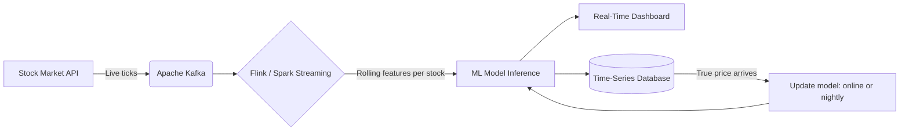

**Example:**
It works like a live sports commentator: as the game happens (the stream), the commentator analyzes each play instantly (stream processing) and predicts the next one (the model). In practice: 500 stocks at one tick per second is only 500 messages per second, which is small for Kafka. The hard part is not volume but correctness: a feature must never use a price from the future.

**Python Code Example:**
```python
from collections import defaultdict, deque

import numpy as np
from sklearn.linear_model import SGDRegressor

WINDOW = 5  # Predict the next price move from the last 5 moves


class OnlinePredictor:
    """Keeps a rolling window per stock and a model that learns from every new tick."""

    def __init__(self):
        self.moves = defaultdict(lambda: deque(maxlen=WINDOW))  # One window PER symbol
        self.last_price = {}
        self.last_features = {}  # What we predicted from, kept until the true answer arrives
        self.model = SGDRegressor(learning_rate='constant', eta0=0.01, random_state=42)
        self.is_trained = False

    def on_tick(self, symbol, price):
        """Call once per tick. Returns the predicted next move in basis points (None while warming up)."""
        if symbol in self.last_price:
            move = (price / self.last_price[symbol] - 1) * 10000  # 1 basis point = 0.01%
            # 1. Learn: the true answer to the previous prediction has just arrived
            if symbol in self.last_features:
                self.model.partial_fit([self.last_features[symbol]], [move])
                self.is_trained = True
            self.moves[symbol].append(move)
        self.last_price[symbol] = price

        # 2. Predict the next move from the newest window
        if len(self.moves[symbol]) < WINDOW:
            return None
        self.last_features[symbol] = list(self.moves[symbol])
        if not self.is_trained:
            return None
        return self.model.predict([self.last_features[symbol]])[0]


# Simulated stream: 2 stocks, 1 tick per second each. A little momentum is built in on purpose;
# real markets are far harder to predict.
rng = np.random.default_rng(42)
predictor = OnlinePredictor()
prices = {'AAPL': 190.0, 'TSLA': 250.0}
last_move = dict.fromkeys(prices, 0.0)
prediction = dict.fromkeys(prices)
hits = total = 0

for second in range(3000):
    for symbol in prices:
        move = 0.4 * last_move[symbol] + rng.normal(0, 1)  # in basis points
        prices[symbol] *= 1 + move / 10000
        last_move[symbol] = move

        if second >= 1500 and prediction[symbol] is not None:  # Score the second half only
            hits += (prediction[symbol] > 0) == (move > 0)
            total += 1
        prediction[symbol] = predictor.on_tick(symbol, prices[symbol])

print(f"Direction of the next move predicted correctly: {hits / total:.0%} (coin flip: 50%)")
```

**Output:**
```text
Direction of the next move predicted correctly: 61% (coin flip: 50%)
```

The model learns the built-in momentum while the stream is running. On real prices, expect a result close to 50%.

**Python Code Example (production hookup, needs a Kafka broker):**
```python
# Production: the same OnlinePredictor class (defined above), fed by Kafka instead of the simulation
import json

from kafka import KafkaConsumer

consumer = KafkaConsumer('live_stock_ticks', bootstrap_servers='localhost:9092',
                         value_deserializer=lambda m: json.loads(m.decode('utf-8')))
predictor = OnlinePredictor()

for message in consumer:
    tick = message.value  # e.g. {"symbol": "AAPL", "price": 190.12}
    prediction = predictor.on_tick(tick['symbol'], tick['price'])
    if prediction is not None:
        print(f"{tick['symbol']} price={tick['price']} predicted next move={prediction:+.2f} bp")
```

---

## 4. Scaling Data Analysis (10x Volume)
**Question:** Given a scenario where your organization suddenly needs to scale its data analysis capabilities due to an influx of data (10x the normal volume), how would you handle this situation to ensure your data analytics processes remain efficient and accurate? What technologies would you consider, and what steps would you take?

**Answer:**
First measure what "10x" means in gigabytes. The right fix depends on whether the data still fits on one machine.

**Step 1: Measure**
Check the current data size, how fast it grows, and which jobs are slow. Going from 10 GB to 100 GB is a different problem from going from 1 TB to 10 TB.

**Step 2: Scale Up First (Vertical)**
If the data still fits in the memory of one large cloud machine (roughly under 100 GB), rent a bigger machine, switch from Pandas to **Polars** or **DuckDB**, and store the data as **Parquet** instead of CSV. This is the cheapest and fastest fix.

**Step 3: Scale Out When One Machine Is Not Enough (Horizontal)**
Move the data to cloud object storage (**Amazon S3**, **Google Cloud Storage**) and process it with a distributed engine (**Apache Spark**, **Dask**) or a serverless warehouse (**BigQuery**, **Snowflake**).

**Step 4: Keep the Results Accurate**
At 10x volume, bad data hides easily. Check row counts, missing values and column types on every load, compare totals with the source system, and process only the new data instead of recomputing everything.

**🔥 Pro Tip / Common Pitfall (Distributed Overhead):**
Spark has real overhead: starting a cluster and moving data between machines takes time. Using Spark for 10 GB is a common mistake. If the data fits in memory on one machine, that machine is usually faster and cheaper.

**Visual Diagram:**
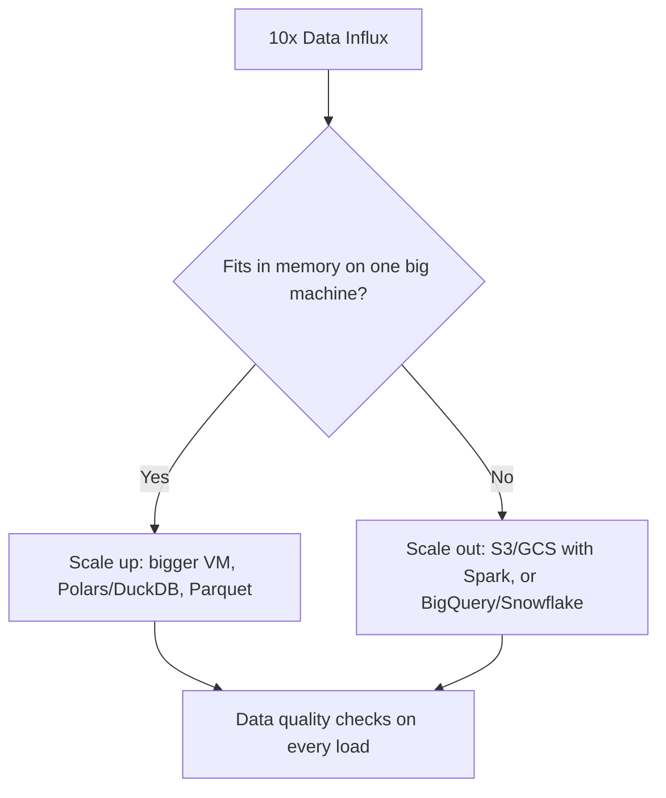

**Example:**
A bakery that gets 10 times more orders first buys a bigger oven (scale up). Only when no oven is big enough does it hire ten bakers and split the work (scale out), which adds coordination cost. In practice: if daily logs grow from 8 GB to 80 GB, a machine with 128 GB of memory and Parquet files solve it. If they grow to 800 GB, move to Spark or BigQuery.

**Python Code Example (needs a Spark cluster):**
```python
# Scale-out path: PySpark reading many CSV files from cloud storage
from pyspark.sql import SparkSession, functions as F
from pyspark.sql.types import DoubleType, StringType, StructField, StructType, TimestampType

spark = SparkSession.builder.appName("DataScale").getOrCreate()

# Give Spark the schema. Asking it to guess (inferSchema=True) costs an extra full pass over the data.
schema = StructType([
    StructField("order_id", StringType()),
    StructField("product_id", StringType()),
    StructField("revenue", DoubleType()),
    StructField("order_time", TimestampType()),
])
df = spark.read.csv("s3a://massive-data-bucket/transactions_*.csv", header=True, schema=schema)

# Data quality check before trusting any result
quality = df.agg(
    F.count("*").alias("rows"),
    F.sum(F.col("revenue").isNull().cast("int")).alias("missing_revenue"),
    F.countDistinct("order_id").alias("unique_orders"),
).first()
print(quality)

# Distributed aggregation: the work runs on the cluster, only the small summary comes back
sales_summary = df.groupBy("product_id").agg(F.sum("revenue").alias("total_revenue"))
sales_summary.orderBy(F.desc("total_revenue")).show(5)

# Save as Parquet so the next job reads only the columns it needs
df.write.mode("overwrite").parquet("s3a://massive-data-bucket/transactions_parquet/")
```

---

## 5. Deploying ML Model to Production
**Question:** You've developed a machine learning model that performs well in a testing environment. Now, you need to integrate it into your production environment where it will be used in real-time applications. What steps would you take to ensure the successful deployment and operation of this model in production?

**Answer:**
A model that works in a notebook is not yet a product. Deploying it safely is the core of MLOps.

**Step 1: Package**
Save the model as a versioned file, wrap it in an API with input validation and a health check, and put everything in a **Docker** container so it runs the same everywhere.

**Step 2: Test Before Release**
Run automated tests in CI/CD: unit tests, a test request against the container, and a load test for latency. Check that the API computes features exactly the way the training code did (no training-serving skew).

**Step 3: Safe Rollout (Canary/Shadow Deployment)**
Run the new model in **Shadow Mode** first (it receives live traffic but its answers are only logged), then as a **Canary Release** (5% of the traffic). Keep a one-command rollback to the previous version.

**Step 4: Monitoring & Observability**
Track latency, error rate, **data drift** and prediction drift with tools like Prometheus/Grafana. Set alerts, and decide in advance which signal triggers retraining.

**Visual Diagram:**
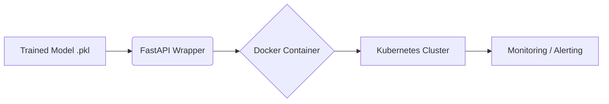

**Example:**
Building the model is like cooking a recipe; deploying it is like opening a restaurant with a standard kitchen (Docker), waiters (the API) and a manager who checks quality (monitoring). In practice: a new pricing model runs in shadow mode for a week and its predictions are logged next to the old model's. Only when they look right does it receive 5% of the traffic.

**Python Code Example (step 1, `train.py`):**
```python
# train.py - run once: train the model and save it together with a version number
import joblib
from sklearn.datasets import make_regression
from sklearn.ensemble import RandomForestRegressor

X, y = make_regression(n_samples=500, n_features=2, noise=10, random_state=42)
model = RandomForestRegressor(n_estimators=50, random_state=42).fit(X, y)
joblib.dump({'model': model, 'version': '1.0.0'}, 'model_v1.joblib')
print("Saved model_v1.joblib")
```

**Python Code Example (step 2, `app.py`):**
```python
# app.py - serve the saved model. Run with: uvicorn app:app --host 0.0.0.0 --port 8000
import logging
import time

import joblib
from fastapi import FastAPI
from pydantic import BaseModel, Field

logging.basicConfig(level=logging.INFO)
artifact = joblib.load('model_v1.joblib')  # Loaded once at startup, not on every request
model, model_version = artifact['model'], artifact['version']

app = FastAPI()


class RequestData(BaseModel):
    # Validation: out-of-range input is rejected with HTTP 422 before it reaches the model
    feature1: float = Field(ge=-10, le=10)
    feature2: float = Field(ge=-10, le=10)


@app.get("/health")
def health():
    # Kubernetes (or any load balancer) calls this to check that the container is alive
    return {"status": "ok", "model_version": model_version}


@app.post("/predict")
def predict(data: RequestData):
    start = time.perf_counter()
    prediction = float(model.predict([[data.feature1, data.feature2]])[0])
    latency_ms = (time.perf_counter() - start) * 1000
    # Log input, output and latency: the raw material for drift and latency monitoring
    logging.info("version=%s input=%s prediction=%.2f latency_ms=%.1f",
                 model_version, data.model_dump(), prediction, latency_ms)
    return {"prediction": prediction, "model_version": model_version}
```

A valid request returns HTTP 200 with the prediction and the model version. A request with `feature1 = 999` returns HTTP 422, because it is outside the allowed range.

**Dockerfile:**
```dockerfile
FROM python:3.12-slim
WORKDIR /app
COPY requirements.txt .
RUN pip install --no-cache-dir -r requirements.txt
COPY app.py model_v1.joblib ./
EXPOSE 8000
CMD ["uvicorn", "app:app", "--host", "0.0.0.0", "--port", "8000"]
```

---

## 6. Shift to Data-Driven Decision Making
**Question:** Your company wants to shift towards more data-driven decision-making. You've been tasked with developing a strategy to implement this. What steps would you take to ensure that data at all levels of the organization is utilized effectively to make informed decisions? What challenges might you face and how would you address them?

**Answer:**
Shifting to data-driven decision-making is as much a cultural change as a technical one.

**Step 1: Start with Decisions, Not Data**
Pick two or three business decisions that matter (for example, which customers get a discount), find a senior sponsor for each, and agree how success will be measured.

**Step 2: Data Centralization & Democratization**
Create a single source of truth (a Data Warehouse), write one agreed definition for every KPI, and give non-technical staff self-service dashboards (Tableau, Looker, Power BI).

**Step 3: Data Literacy**
Train people in every department to read dashboards and to ask "compared with what?". Place an analyst inside each team.

**Step 4: KPI Alignment & Experiments**
Tie every department's goals to tracked numbers, run A/B tests where possible, and measure whether the dashboards are actually used.

**Challenges and how to address them:**

| Challenge | How I would address it |
|---|---|
| Resistance to change ("we have always decided by experience") | Start with a small, visible quick win; ask a senior leader to use the dashboard in meetings |
| Dirty or conflicting data (two reports, two revenue numbers) | One owner per dataset, automated quality checks, one definition per KPI |
| Low data literacy | Short training for each role; analysts inside the teams |
| Data silos and access rules | Central warehouse with role-based access; a clear policy for personal data |
| Dashboards nobody uses | Build each one for a named decision; track usage and delete the unused ones |

**Visual Diagram:**
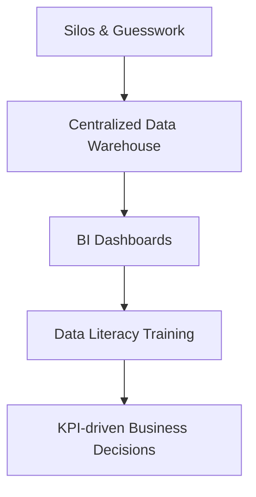

**Example:**
Instead of the Marketing Director running an ad campaign because it "feels right", they look at a dashboard showing that users aged 18-24 give the highest return on ad spend, and target the campaign at that group.

**Python Code Example:**
None. This is a people-and-process question, so code would add nothing.

---

## 7. Analyzing Extremely Large Datasets (Terabytes)
**Question:** Your project involves analyzing extremely large datasets, potentially exceeding terabytes in size. What strategies would you use to manage and analyze such large datasets effectively? Describe the tools and techniques you might employ.

**Answer:**
A terabyte of data does not fit in the memory of one normal machine, so the work has to be split up and the amount of data read has to be kept small.

**Step 1: Distributed Computing**
Use **Apache Spark**, which splits the dataset into chunks and processes them in parallel on a cluster of computers.

**Step 2: Columnar Storage**
Store the data in a columnar format like **Parquet** or **ORC**. These formats compress well and let a query read only the columns it needs.

**Step 3: Cloud Data Warehouses**
For SQL analytics, use **Google BigQuery** or **Snowflake**, which spread each query over many servers automatically.

**Step 4: Read Less Data**
Partition the data (for example by date) so queries skip irrelevant files, explore on a 1% sample first, and use approximate functions such as `approx_count_distinct` when an estimate is enough.

**Visual Diagram:**
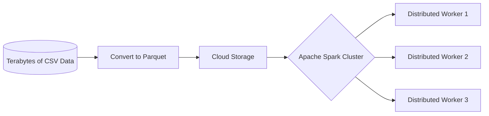

**Example:**
Reading a 1 TB CSV is like reading a whole library book by book to find one quote. Parquet with Spark is like having an index and 100 assistants. In practice: a daily report on 2 TB of click logs stored as CSV scans everything and takes hours. With Parquet partitioned by date, the same report reads one day's folder and two columns.

**Python Code Example (needs a Spark cluster):**
```python
# Reading massive datasets efficiently using PySpark and Parquet
from pyspark.sql import SparkSession, functions as F

spark = SparkSession.builder.appName("TerabyteAnalysis").getOrCreate()

# Parquet partitioned by date: Spark opens only the folders and columns the query needs
df = spark.read.parquet("s3a://data-lake/events/")

# Explore on a 1% sample first; it answers most questions in seconds
df.sample(fraction=0.01, seed=42).groupBy("country").count().show(5)

# Full query: the filter on the partition column (event_date) skips every other day's files
daily = (
    df.filter(F.col("event_date") == "2024-06-01")
      .groupBy("country")
      .agg(F.approx_count_distinct("user_id").alias("unique_users"),  # An estimate, far cheaper than exact
           F.sum("total_spent").alias("revenue"))
)
daily.explain()  # Check the plan: "PartitionFilters" confirms that files are being skipped

# Write the small result back out to distributed storage
daily.write.mode("overwrite").parquet("s3a://data-lake/reports/daily_by_country/")
```

---

## 8. Diagnosing an Underperforming Model
**Question:** During model development, you've noticed that your machine learning model is underperforming. What steps would you take to diagnose the problem and optimize the model's performance? What techniques and tools would you use?

**Answer:**
When a model underperforms, I debug in a fixed order: the baseline, the data, the features, and only then the algorithm.

**Step 1: Baseline & Metric**
Compare the model with a dummy model that has learned nothing, and check that the metric matches the business problem. A model that is "only 70% accurate" may be excellent if the baseline is 50%.

**Step 2: Analyze Learning Curves**
Plot training and validation score against the amount of training data. If both are low, the model has **High Bias** (underfitting: it needs more complexity or better features). If the gap between them is large, it has **High Variance** (overfitting: it needs regularization or more data).

**Step 3: Check Data & Errors**
Look at the confusion matrix for class imbalance, and read the worst mistakes one by one. They often reveal mislabeled rows or a missing feature.

**Step 4: Feature Engineering & Hyperparameters**
Create features that capture the relationships better, then tune hyperparameters with **Grid Search** or **Random Search**. Tune last: if tuning changes the score by less than the difference between cross-validation folds, the problem is in the data or the features.

**Visual Diagram:**
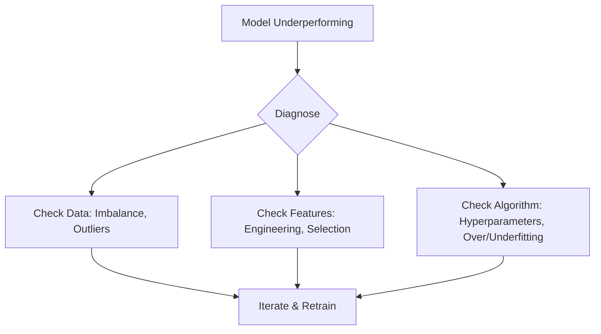

**Example:**
If a car drives badly you do not buy a new car. You check the tires (data quality), the steering (features) and only then tune the engine (hyperparameters). In practice: a fraud model stuck at 60% recall improved more from one new feature (transactions in the last hour) than from a week of tuning.

**Python Code Example:**
```python
from sklearn.datasets import make_classification
from sklearn.dummy import DummyClassifier
from sklearn.ensemble import RandomForestClassifier
from sklearn.model_selection import RandomizedSearchCV, learning_curve, train_test_split

X, y = make_classification(n_samples=2000, n_features=20, n_informative=6, flip_y=0.1, random_state=42)
X_train, X_test, y_train, y_test = train_test_split(X, y, test_size=0.2, random_state=42)

# Step 1: Baseline - how good is a model that has learned nothing?
baseline = DummyClassifier(strategy='most_frequent').fit(X_train, y_train)
print(f"Baseline test accuracy: {baseline.score(X_test, y_test):.2f}")

# Step 2: Learning curve - both scores low = high bias; big gap between them = high variance
model = RandomForestClassifier(n_estimators=100, random_state=42)
sizes, train_scores, val_scores = learning_curve(model, X_train, y_train, cv=3, train_sizes=[0.2, 0.5, 1.0])
for n, train_acc, val_acc in zip(sizes, train_scores.mean(axis=1), val_scores.mean(axis=1)):
    print(f"  {n:5d} rows: train={train_acc:.2f}  validation={val_acc:.2f}  gap={train_acc - val_acc:.2f}")

# Step 4: Tune on the training data only, then score ONCE on the untouched test set
search = RandomizedSearchCV(
    model,
    param_distributions={'max_depth': [5, 10, None], 'min_samples_leaf': [1, 5, 20], 'max_features': ['sqrt', 0.5]},
    n_iter=8, cv=3, random_state=42,
)
search.fit(X_train, y_train)
print(f"Untuned test accuracy:  {model.fit(X_train, y_train).score(X_test, y_test):.2f}")
print(f"Tuned test accuracy:    {search.score(X_test, y_test):.2f}  {search.best_params_}")
```

**Output:**
```text
Baseline test accuracy: 0.48
    213 rows: train=1.00  validation=0.83  gap=0.17
    533 rows: train=1.00  validation=0.86  gap=0.14
   1066 rows: train=1.00  validation=0.87  gap=0.13
Untuned test accuracy:  0.86
Tuned test accuracy:    0.87  {'min_samples_leaf': 5, 'max_features': 0.5, 'max_depth': None}
```

The learning curve shows high variance (training 1.00, validation 0.87) and the gap shrinks as rows are added, so more data would help. Tuning adds only one point (0.86 to 0.87): hyperparameters are not the main lever here.

---

## 9. Managing Unstructured Data (Text, Images, Videos)
**Question:** You are given a large volume of unstructured data including text, images, and videos. What strategies would you use to manage and analyze this type of data effectively? Describe the tools and techniques you might employ.

**Answer:**
Unstructured data does not fit into rows and columns, so the strategy is to store the raw files cheaply and turn them into numbers that can be searched and analyzed.

**Step 1: Storage & Catalog**
Keep the raw files in a Data Lake (AWS S3) and record every file in a metadata table (path, type, date, source, owner), so files can be found and access can be controlled. Remove personal data before indexing.

**Step 2: Text**
Split documents into chunks, convert each chunk into an **embedding** (a list of numbers that captures its meaning) and store the embeddings in a **Vector Database** (Pinecone, Milvus, pgvector). Then:
* **Search and Q&A:** find the chunks closest to a question and give them to an LLM as context. This is **RAG** (Retrieval-Augmented Generation).
* **Batch extraction:** run an NLP model or an LLM over every document to pull entities, topics and sentiment into a normal table.

**Step 3: Images**
Use pre-trained models: object detection (YOLO), classification and embeddings (ResNet, CLIP), and OCR for text inside images.

**Step 4: Video**
Video is images plus audio. Sample frames (for example one per second) and run the image models on them; transcribe the audio (for example with Whisper) and run the text pipeline on the transcript.

**Visual Diagram:**
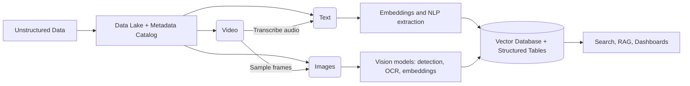

**Example:**
A support team has 2 million tickets, 50,000 product photos and 3,000 hours of call recordings. The calls are transcribed to text. Tickets and transcripts are embedded, so an agent can type "refund for double payment" and get the most similar past cases. The photos go through a damage-detection model.

**Python Code Example:**
```python
from sklearn.feature_extraction.text import TfidfVectorizer
from sklearn.metrics.pairwise import cosine_similarity

# Unstructured text: support tickets, call transcripts, video transcripts ...
documents = [
    "The delivery arrived two weeks late and the box was damaged.",
    "I was charged twice for the same order, please refund one payment.",
    "The app crashes every time I open the camera on my phone.",
    "Great service, the courier was friendly and the parcel came early.",
    "Cannot log in after the update, the password reset email never arrives.",
]

# Step 1: Turn every document into a vector of numbers
vectorizer = TfidfVectorizer(stop_words='english')
document_vectors = vectorizer.fit_transform(documents)


# Step 2: Search - turn the question into a vector the same way and find the closest document
def search(question):
    scores = cosine_similarity(vectorizer.transform([question]), document_vectors)[0]
    best = scores.argmax()
    return documents[best], round(float(scores[best]), 2)


for question in ["I want a refund for a double payment", "the app stops working on my phone"]:
    document, score = search(question)
    print(f"{question!r}\n  -> {document!r} (similarity {score})")
```

**Output:**
```text
'I want a refund for a double payment'
  -> 'I was charged twice for the same order, please refund one payment.' (similarity 0.63)
'the app stops working on my phone'
  -> 'The app crashes every time I open the camera on my phone.' (similarity 0.58)
```

This is the search step in miniature. TF-IDF matches shared words; replace it with a neural embedding model (for example `sentence-transformers`) to also match synonyms, and replace the in-memory matrix with a vector database when there are millions of documents. The search logic stays the same.

---

## 10. Scaling AI Operations Enterprise-Wide
**Question:** Your company wants to scale its AI operations from a few initial pilot projects to enterprise-wide implementation. What are the key considerations and steps you would take to ensure the successful scaling of AI solutions across the organization? What challenges might you face and how would you address them?

**Answer:**
Scaling AI means moving from individual Jupyter notebooks to standard engineering practices that every team shares.

**Step 1: Prioritize & Organize**
Rank the use cases by business value and feasibility. Set up a central platform team that builds shared tools, with data scientists working inside the business units.

**Step 2: MLOps & Feature Stores**
Track every experiment and model with **MLflow** or **Kubeflow**. Add a **Feature Store** (like Feast) so teams reuse the same features, and training and production stay consistent.

**Step 3: Standardized Infrastructure**
Provide one cloud setup and one CI/CD pipeline, so every data scientist builds, tests and deploys models the same way.

**Step 4: Governance & Ethics**
Create an AI review board that checks models for regulatory compliance, bias and safe handling of customer data before release.

**Challenges and how to address them:**

| Challenge | How I would address it |
|---|---|
| Pilots that never reach production | Require a production owner and a success metric before a project starts |
| Every team builds its own stack | One paved path: shared templates, CI/CD, feature store, model registry |
| Not enough skilled people | Central platform team, training, and reuse instead of rebuilding |
| Rising cloud costs | Tag costs per model, set budgets, shut down idle resources |
| Risk and regulation | Review board, model documentation, bias and privacy checks before release |
| Models that silently get worse | Central monitoring with alerts, and a named owner for every model |

**Visual Diagram:**
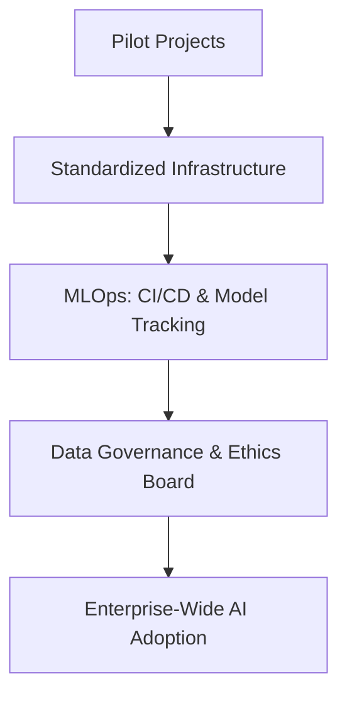

**Example:**
It is like growing from a home cook into a restaurant franchise: you need standard procedures, supply chains and health inspections so every meal is the same quality in 100 locations. In practice: a bank with five pilot models finds that each team deploys differently and nobody can say which model version is live. A shared MLflow server and one deployment template fix that before model number six.

**Python Code Example (run in `mlflow_env`):**
```python
import mlflow
import mlflow.sklearn
from sklearn.datasets import make_classification
from sklearn.linear_model import LogisticRegression
from sklearn.model_selection import train_test_split

# In a company, every team points at the same tracking server, so all experiments are in one place:
#   mlflow.set_tracking_uri("http://mlflow.your-company.internal:5000")
# Without that line MLflow stores the run locally, which is fine for trying this example.
mlflow.set_experiment("churn-model")

X, y = make_classification(n_samples=1000, random_state=42)
X_train, X_test, y_train, y_test = train_test_split(X, y, test_size=0.2, random_state=42)

with mlflow.start_run(run_name="logistic-regression-baseline") as run:
    params = {"C": 1.0, "max_iter": 200}
    model = LogisticRegression(**params).fit(X_train, y_train)
    accuracy = model.score(X_test, y_test)

    # Log what was tried, how well it did, and the model itself
    mlflow.log_params(params)
    mlflow.log_metric("accuracy", accuracy)
    mlflow.sklearn.log_model(model, name="model")

    print(f"Run logged with accuracy={accuracy:.2f}. Browse all runs with: mlflow ui")
```

**Output:**
```text
Run logged with accuracy=0.85. Browse all runs with: mlflow ui
```

---

## 11. Ethical Considerations in Data Science
**Question:** In your data science projects, how do you ensure that ethical considerations are addressed? Describe the steps you take to identify and mitigate ethical risks in your projects. What frameworks or guidelines do you follow?

**Answer:**
Ethics in AI is critical to prevent harm, bias and privacy violations. I treat it as part of the engineering process, not as an afterthought.

**Step 1: Bias & Fairness**
Check how the data was collected and who is under-represented. Then compare the model's outcomes across groups: how often each group is selected, and how often qualified people in each group are selected. Accuracy alone is not enough.

**Step 2: Privacy**
Collect only what is needed, mask or remove personal data (PII) before training, and control who can access it. Keep protected attributes such as gender in a separate, restricted table: the model must not use them, but you need them to *test* for bias. Removing the column does not remove the bias, because other columns (postcode, hobbies) can stand in for it.

**Step 3: Explainability & Transparency**
Use tools like SHAP or LIME to explain *why* the model made a decision, and document the model's purpose, data and limits (a model card).

**Step 4: Human Oversight & Monitoring**
For high-stakes decisions, keep a human in the loop and give people a way to appeal. Re-run the fairness checks after deployment, because data changes.

**Step 5: Frameworks**
Follow the laws that apply, such as the **GDPR** and the **EU AI Act**, and voluntary frameworks such as the **NIST AI Risk Management Framework**. Add a company ethics review for high-risk projects.

**Visual Diagram:**
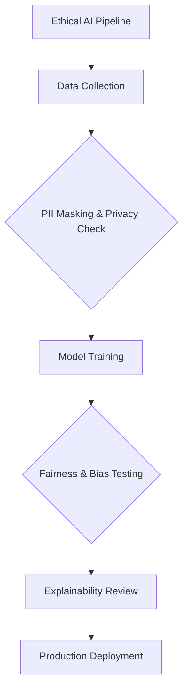

**Example:**
For a resume-screening AI, I would keep gender out of the model's inputs but available for testing, then check whether qualified women are shortlisted as often as qualified men. Amazon scrapped an internal recruiting tool (reported in 2018) after finding that it penalized resumes containing the word "women's".

**Python Code Example:**
```python
import pandas as pd

# Mock hiring decisions from a model: 200 applicants per group, half of them qualified
df = pd.DataFrame({
    'group': ['A'] * 200 + ['B'] * 200,
    'qualified': ([1] * 100 + [0] * 100) * 2,
    'hired': [1] * 80 + [0] * 20 + [1] * 20 + [0] * 80     # Group A: 80 qualified and 20 unqualified hired
           + [1] * 60 + [0] * 40 + [0] * 100,              # Group B: 60 qualified and 0 unqualified hired
})
df['correct'] = (df['hired'] == df['qualified']).astype(int)

report = pd.DataFrame({
    'accuracy': df.groupby('group')['correct'].mean(),
    'selection_rate': df.groupby('group')['hired'].mean(),                            # Share of the group that is hired
    'true_positive_rate': df[df['qualified'] == 1].groupby('group')['hired'].mean(),  # Share of QUALIFIED people hired
})
print(report)

# Four-fifths rule: the lowest selection rate should be at least 80% of the highest
ratio = report['selection_rate'].min() / report['selection_rate'].max()
print(f"\nDisparate impact ratio: {ratio:.2f} -> {'OK' if ratio >= 0.8 else 'FLAG for review'}")
```

**Output:**
```text
       accuracy  selection_rate  true_positive_rate
group                                              
A           0.8             0.5                 0.8
B           0.8             0.3                 0.6

Disparate impact ratio: 0.60 -> FLAG for review
```

Both groups get the same accuracy (0.8), so a check based only on accuracy would call this model fair. But group B is hired far less often (30% against 50%), and a qualified person in group B has a 60% chance of being hired against 80% in group A.

---

## 12. Forecasting Monthly Sales
**Question:** You are tasked with forecasting monthly sales for a retail company using time-series data from the past five years. What steps would you take to prepare and analyze this data to make accurate forecasts? What specific tools or techniques would you use, and why?

**Answer:**
Five years of monthly data is only **60 data points**. With so little data, simple models and careful validation matter more than a sophisticated algorithm.

**Step 1: Data Prep**
Aggregate the sales to monthly totals, fill or flag missing months, and note known events (promotions, store openings, unusual periods).

**Step 2: Decomposition**
Split the series into **Trend** (overall direction), **Seasonality** (repeating patterns such as the December peak) and **Residuals** (random noise), and plot them.

**Step 3: Baseline**
Forecast with "same month last year" (seasonal naive). Any model must beat this.

**Step 4: Modeling**
With 60 points, prefer simple models:
* **Holt-Winters (ETS)**: models level, trend and season directly.
* **SARIMA**: needs stationary data, so first difference the series to remove trend and seasonality.
* **Prophet**: handles trend, yearly seasonality and missing months automatically, and does not need stationary data.

**Step 5: Evaluate & Forecast**
Hold out the last 12 months and measure the error with MAPE or MAE. Keep the model only if it beats the baseline, then refit on all 60 months and forecast with prediction intervals.

**🔥 Pro Tip / Common Pitfall (Time-Series Validation):**
Never validate a time series with ordinary K-Fold cross-validation. K-Fold lets the model train on months that come *after* the months it is tested on, so it predicts the past from the future and the score looks better than it really is. Use a **Time-Series Split (expanding window)**: always train on the past and test on the next block.

**Visual Diagram:**
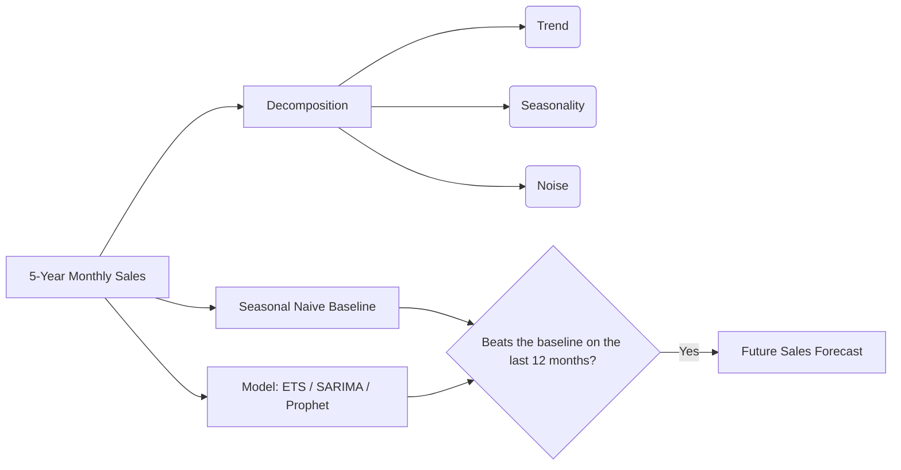

**Example:**
A retailer's sales grow every year and jump by half every December. "Same month last year" already captures the December peak but misses the growth. A good model must capture both.

**Python Code Example:**
```python
import numpy as np
import pandas as pd
from sklearn.linear_model import LinearRegression
from sklearn.metrics import mean_absolute_percentage_error
from sklearn.model_selection import TimeSeriesSplit

# 5 years of monthly sales = only 60 data points: upward trend + December peak + noise
rng = np.random.default_rng(42)
months = pd.date_range('2019-01-01', periods=60, freq='MS')
seasonal_pattern = np.array([0.9, 0.85, 0.95, 1.0, 1.0, 1.05, 1.0, 0.95, 1.0, 1.05, 1.2, 1.5])
sales = (10000 + 150 * np.arange(60)) * seasonal_pattern[months.month - 1] * rng.normal(1, 0.04, 60)
df = pd.DataFrame({'ds': months, 'y': sales.round()})

# Time-ordered split: train on the first 4 years, test on the last 12 months. Never shuffle.
train, test = df.iloc[:48], df.iloc[48:]

# Baseline: "same month last year" (seasonal naive). Any model must beat this.
naive_forecast = train['y'].iloc[-12:].to_numpy()


# Model: trend + one on/off column per month (the same ingredients ARIMA and Prophet use)
def make_features(frame):
    features = pd.get_dummies(frame['ds'].dt.month, prefix='month').astype(float)
    features['trend'] = frame.index
    return features


model = LinearRegression().fit(make_features(train), np.log(train['y']))  # log: the season multiplies sales
model_forecast = np.exp(model.predict(make_features(test)))

print(f"Seasonal naive MAPE: {mean_absolute_percentage_error(test['y'], naive_forecast):.1%}")
print(f"Trend + season MAPE: {mean_absolute_percentage_error(test['y'], model_forecast):.1%}")

# Time-series cross-validation: always train on the past and test on the next 12 months
for fold, (train_idx, test_idx) in enumerate(TimeSeriesSplit(n_splits=3, test_size=12).split(df), start=1):
    print(f"Fold {fold}: train on months 1-{train_idx[-1] + 1}, test on months {test_idx[0] + 1}-{test_idx[-1] + 1}")
```

**Output:**
```text
Seasonal naive MAPE: 9.6%
Trend + season MAPE: 5.6%
Fold 1: train on months 1-24, test on months 25-36
Fold 2: train on months 1-36, test on months 37-48
Fold 3: train on months 1-48, test on months 49-60
```

The model beats the baseline (5.6% error against 9.6%) because it captures the growth that "same month last year" misses. Swap in ETS, SARIMA or Prophet the same way: same test window, same baseline.

---

> **Note on Practical Scenarios (Q13 - Q20):**
> The full programs are the standalone scripts `13.py` to `20.py` in this folder. The snippets below are copied from those files, and each "Result when run" is the script's real output.

---

## 13. Customer Segmentation (Clustering)
**Question:** You are given a dataset containing demographic and purchasing behavior data for a group of customers. Your task is to segment these customers into distinct groups based on similarities in their purchasing behavior and demographics. What steps would you take to perform this segmentation, and can you provide a sample Python code snippet to illustrate the initial stages of data handling and model application?

**Answer:**
This is an unsupervised learning problem: there is no "right answer" column, so the model groups similar customers by itself.

**Step 1: Data Prep**
Handle missing values and, crucially, **scale the data** (using StandardScaler). Distance-based algorithms fail if one column is in thousands (income) and another in tens (age). K-Means also needs numbers, so cluster on the numeric columns and use categorical demographics such as gender to describe the clusters afterwards.

**Step 2: Determine Clusters**
Use the **Elbow Method** and the **silhouette score** to choose the number of clusters ($k$), instead of guessing.

**Step 3: Clustering**
Apply **K-Means clustering**, then look at the size and the average characteristics of each cluster and give it a business persona (e.g., "High-income bargain hunters"). Keep a segmentation only if the business can act on it.

**Visual Diagram:**
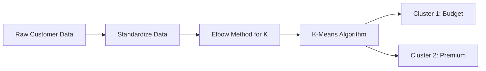

**Example:**
A mall groups its shoppers by age, income and spending. "Young, low income, high spending" gets student offers; "high income, low spending" gets premium loyalty offers.

**Core Implementation Snippet** (from `13.py`):
```python
# Scale the features so that no column dominates the distance calculation
scaler = StandardScaler()
data_scaled = scaler.fit_transform(data[features])

# Choosing the number of clusters: elbow method (SSE) and silhouette score (higher is better)
k_values = list(range(2, 7))
sse, silhouettes = [], []
for k in k_values:
    kmeans = KMeans(n_clusters=k, n_init=10, random_state=42)
    labels = kmeans.fit_predict(data_scaled)
    sse.append(kmeans.inertia_)
    silhouettes.append(silhouette_score(data_scaled, labels))
    print(f"k={k}: SSE={sse[-1]:.1f}, silhouette={silhouettes[-1]:.3f}")

# Use the k with the best silhouette score instead of a hard-coded guess
best_k = k_values[silhouettes.index(max(silhouettes))]
print(f"Best k by silhouette score: {best_k}")

# Applying K-Means Clustering
kmeans = KMeans(n_clusters=best_k, n_init=10, random_state=42)
data['Cluster'] = kmeans.fit_predict(data_scaled)
```

**Result when run:** the script picks k=5 (silhouette 0.424) and prints the size, averages and gender mix of each cluster. The sample file has only 30 customers, so treat the clusters as a demo, not as real segments.

---

## 14. Customer Churn Prediction
**Question:** You are tasked with developing a model to predict which customers are likely to churn from a subscription service. What steps would you take to build this model, and can you provide a sample Python code snippet to illustrate the data preparation and model training process?

**Answer:**
This is a binary classification problem: for each customer, will they leave or stay?

**Step 1: Define Churn and the Snapshot Date**
Decide exactly what churn means, for example "cancelled within 30 days after the snapshot date". Build every feature from data recorded *before* that date.

**Step 2: Feature Engineering**
Calculate features like tenure, monthly spend, support tickets in the last 90 days, days since last login and contract type.

**Step 3: Handle Imbalance**
Most customers do not churn, so the classes are imbalanced. Start with **class weights** (`class_weight='balanced'`), which need no synthetic data. **SMOTE** (Synthetic Minority Over-sampling) is an alternative.

**Step 4: Modeling & Evaluation**
Train **Logistic Regression** as a simple reference, then a **Random Forest** or gradient boosting model. Evaluate with **Precision, Recall and PR-AUC**, not accuracy, and always compare with a baseline.

**Step 5: Act on the Predictions**
Send retention offers to the customers with the highest risk, and measure the effect with an A/B test.

**🔥 Pro Tip / Common Pitfall (Leakage):**
Two mistakes make a churn model look far better than it is. First, a feature recorded *after* the customer left (a cancellation reason, a final invoice) gives the answer away. Second, if you use SMOTE, apply it **only** to the training data, inside an `imblearn` Pipeline, so every cross-validation fold is resampled separately. Never oversample the test set: it must keep the real, imbalanced distribution.

**Visual Diagram:**
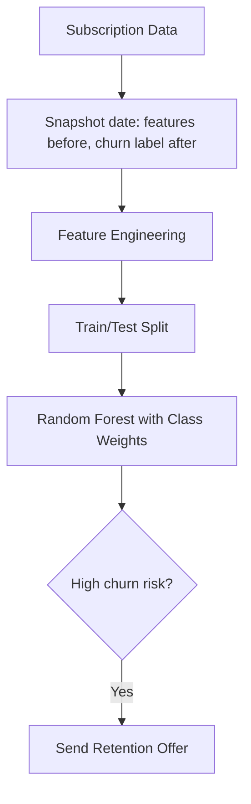

**Example:**
A streaming service with 100,000 subscribers can afford to call only 10,000 of them. The model ranks customers by risk, so the calls go to the people most likely to leave instead of to a random 10%.

**Core Implementation Snippet** (from `14.py`):
```python
# Split BEFORE doing anything else; stratify keeps the same churn rate in both parts
X_train, X_test, y_train, y_test = train_test_split(X, y, test_size=0.2, stratify=y, random_state=42)

# Handle imbalance with class weights: mistakes on the rare class (churners) cost more
print("\n3. Training Random Forest Model...")
model = RandomForestClassifier(n_estimators=200, min_samples_leaf=5, class_weight='balanced', random_state=42)
model.fit(X_train, y_train)

# Evaluate with precision and recall on the churn class, not accuracy
churn_risk = model.predict_proba(X_test)[:, 1]
print("\n4. Evaluation on Test Set:")
print(classification_report(y_test, model.predict(X_test), target_names=['stays', 'churns']))
print(f"PR-AUC: {average_precision_score(y_test, churn_risk):.2f} (a random model scores about {y_test.mean():.2f})")
```

**Result when run** (5,000 synthetic customers, 15% churn): always predicting "stays" is 85% accurate but finds no churners. The model finds 68% of the churners (recall) with 41% precision, and its PR-AUC is 0.50 against 0.15 for a random model. Among the riskiest 10% of customers, 55% churn.

---

## 15. Sentiment Analysis using Deep Learning
**Question:** You are tasked with developing a sentiment analysis model using deep learning to understand customer opinions from reviews. What steps would you take to build this model, and can you provide a sample Python code snippet to illustrate how you would preprocess data and train a simple deep learning model?

**Answer:**
This is text classification: a review goes in, "positive" or "negative" comes out.

**Step 1: Text Preprocessing**
Convert the text to lowercase, split it into words (tokens), replace each word with an integer ID and pad every review to the same length.

**Step 2: Word Embeddings**
Convert each word ID into a vector of numbers, using an embedding layer that is trained with the model or pre-trained embeddings (like GloVe).

**Step 3: Deep Learning Model**
Use an **LSTM (Long Short-Term Memory)** network. It reads the words in order and remembers the context, so it can tell "good" from "not good".

**Step 4: Evaluate**
Measure accuracy on reviews the model has never seen and compare it with a baseline.

**🔥 Pro Tip / Common Pitfall (Start from a Pre-trained Model):**
With few labelled reviews, fine-tune a pre-trained **Transformer** (for example DistilBERT) instead of training an LSTM from scratch: it already knows the language and usually scores higher. Also compare with a cheap baseline such as TF-IDF plus Logistic Regression; if the deep model does not beat it clearly, ship the simple one.

**Visual Diagram:**
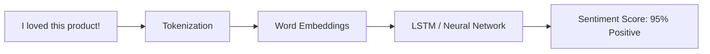

**Example:**
An online shop receives 20,000 reviews a month. The model scores every review, the team reads only the most negative ones, and a dashboard tracks the weekly share of negative reviews per product.

**Core Implementation Snippet** (from `15.py`):
```python
# 3. Build the LSTM model
model = keras.Sequential([
    layers.Embedding(input_dim=VOCAB_SIZE, output_dim=32),  # Word ID -> vector of 32 numbers
    layers.LSTM(32),                                        # Reads the review word by word
    layers.Dropout(0.5),                                    # Reduces overfitting
    layers.Dense(1, activation='sigmoid')                   # Probability that the review is positive
])
model.compile(loss='binary_crossentropy', optimizer='adam', metrics=['accuracy'])

# 4. Train; stop early when the validation loss stops improving
early_stopping = keras.callbacks.EarlyStopping(monitor='val_loss', patience=1, restore_best_weights=True)
model.fit(x_train, y_train, epochs=5, batch_size=128, validation_split=0.2, callbacks=[early_stopping], verbose=2)
```

**Result when run** (IMDB movie reviews, about 2 minutes of training on a CPU): 85% accuracy on 25,000 unseen reviews, against a 50% baseline. "This movie was fantastic, I loved every minute of it." scores 0.77 positive; "Terrible film. Boring plot and awful acting, a complete waste of time." scores 0.01.

---

## 16. Anomaly Detection for Fraud
**Question:** You are tasked with identifying unusual transactions in a company's financial data that might suggest fraudulent activity. What steps would you take to develop an anomaly detection model, and can you provide a sample Python code snippet to illustrate how you would preprocess the data and apply an anomaly detection technique?

**Answer:**
Fraud is rare and confirmed labels arrive late, so I would start with unsupervised anomaly detection and add supervised models as confirmed cases accumulate.

**Step 1: Data Prep & Features**
Clean the data and build features that describe behavior: hour of day, the amount compared with the customer's usual amount, the number of transactions in the last hour, a new merchant, country or device. (The sample script uses only the amount and the hour.)

**Step 2: Unsupervised Anomaly Detection**
Use an algorithm like **Isolation Forest**. It separates points with random splits; a point that is isolated after only a few splits is unusual. It is tree-based, so the features do not need scaling.

**Step 3: Review & Evaluation**
Rank the transactions by anomaly score and send the top N to the analysts, where N is what the team can review, not a guessed fraud rate. Then measure **precision** (how many flagged transactions were fraud) and **recall** (how many frauds were flagged) against the confirmed cases, and compare with a simple rule.

**Step 4: Feedback Loop**
Every reviewed transaction becomes a label. Once there are enough labels, train a supervised model (gradient boosting) and run it next to the anomaly detector.

**Visual Diagram:**
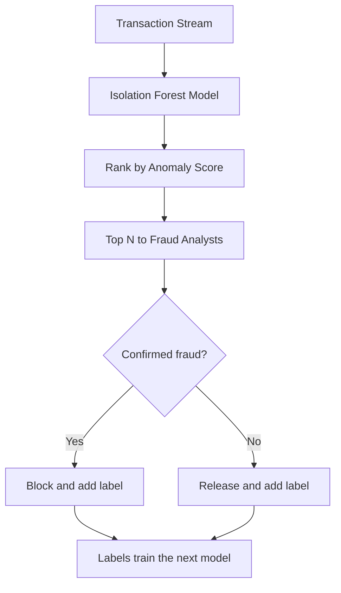

**Example:**
A bank processes one million card payments a day and its analysts can check 500. The model's job is to choose the best 500: a large payment at 3 a.m. from a card that normally buys groceries at noon goes to the top of the list.

**Core Implementation Snippet** (from `16.py`):
```python
# Anomaly Detection using Isolation Forest (it never sees the 'is_fraud' column)
model = IsolationForest(n_estimators=200, random_state=42)
model.fit(data[features])

# score_samples: the lower the score, the more unusual the transaction
data['anomaly_score'] = model.score_samples(data[features])

# Send the most unusual transactions to the fraud team, most suspicious first
flagged = data.sort_values('anomaly_score').head(REVIEW_CAPACITY)

# Evaluation: compare the flags with the fraud cases that were confirmed later
caught = flagged['is_fraud'].sum()
total_fraud = data['is_fraud'].sum()
print(f"\nFlagged for review: {len(flagged)} of {len(data)} transactions")
print(f"Precision: {caught / len(flagged):.0%} of the flagged transactions were real fraud")
print(f"Recall: {caught} of {total_fraud} real fraud cases were caught")
```

**Result when run** (1,000 transactions, 10 of them fraud): the 20 flagged transactions contain 9 of the 10 frauds (45% precision). Reviewing the 20 largest amounts instead catches only 5.

---

## 17. Real Estate Price Prediction (Web App Integration)
**Question:** You've developed a machine learning model to predict real estate prices based on various features like location, size, and amenities. How would you integrate this model into a web application to allow users to get real-time price predictions? Can you provide a sample Python code snippet to illustrate how you would prepare the model for integration and handle user requests?

**Answer:**
Wrap the model in a small web API. The web page sends the house details and gets a price back.

**Step 1: Serialize Model**
Save the whole pipeline (preprocessing plus model) to disk with `pickle` or `joblib`, so the API transforms the input exactly as the training code did. Only load pickle files you created yourself: loading a pickle can run arbitrary code.

**Step 2: API Development**
Create a backend API with **Flask** (used in `17.py`) or **FastAPI**. Load the model once, when the server starts.

**Step 3: Endpoint with Validation**
Create a `POST /predict` endpoint that accepts JSON (location, size, amenities and so on), **validates** it, and returns the predicted price as JSON. Bad input gets HTTP 400 with a clear message instead of a meaningless price.

**Step 4: Run It Properly**
Use a production server such as gunicorn behind HTTPS, not the debug server. Add a health-check endpoint and log every request and prediction.

**Visual Diagram:**
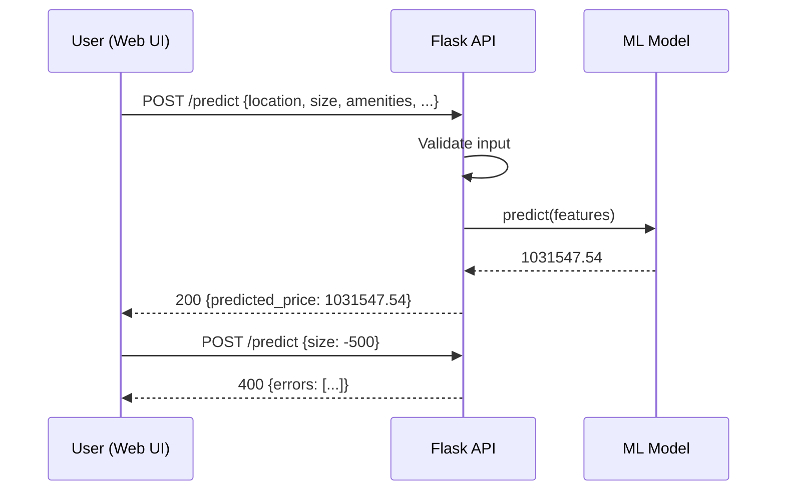

**Example:**
A property website shows an "Estimate my home's value" form. Start the API with `python 17.py`, then send it a request:
```bash
curl -X POST http://127.0.0.1:5000/predict -H "Content-Type: application/json" \
  -d '{"location": "Downtown", "size": 1500, "amenities": "Premium", "year_built": 2005, "num_bedrooms": 3, "num_bathrooms": 2}'
# {"predicted_price":1031547.54}
```

**Core Implementation Snippet** (from `17.py`):
```python
def validate(data):
    """Returns a list of problems with the request. An empty list means the request is valid."""
    if not isinstance(data, dict):
        return ['Request body must be a JSON object']
    errors = []
    if data.get('location') not in ALLOWED_LOCATIONS:
        errors.append(f"location must be one of {list(ALLOWED_LOCATIONS)}")
    if data.get('amenities') not in ALLOWED_AMENITIES:
        errors.append(f"amenities must be one of {list(ALLOWED_AMENITIES)}")
    for field, (low, high) in NUMERIC_RANGES.items():
        value = data.get(field)
        if isinstance(value, bool) or not isinstance(value, (int, float)) or not low <= value <= high:
            errors.append(f"{field} must be a number between {low} and {high}")
    return errors

@app.route('/predict', methods=['POST'])
def predict():
    # Extract and validate the features from the POST request
    data = request.get_json(silent=True)
    errors = validate(data)
    if errors:
        return jsonify({'errors': errors}), 400

    # The model expects the six features in exactly this order
    features = [data['location'], data['size'], data['amenities'],
                data['year_built'], data['num_bedrooms'], data['num_bathrooms']]

    # Make prediction
    prediction = model.predict([features])

    # Return the prediction as a JSON object
    return jsonify({'predicted_price': round(float(prediction[0]), 2)})
```

**Result when run:** the request above returns HTTP 200 with the price. A request with `"location": "Mars"` and `"size": -500` returns HTTP 400 with one error message per bad field.

---

## 18. Geospatial Data Analysis (Public Transport)
**Question:** You are tasked with analyzing geospatial data to help a city improve its public transportation system. The data includes GPS coordinates of bus stops, ridership numbers, and traffic patterns. What steps would you take to analyze this data, and can you provide a sample Python code snippet to illustrate how you might visualize bus stop locations and ridership?

**Answer:**
The goal is to show the city where demand is high, where buses are slow, and where people have no stop nearby.

**Step 1: Load & Align the Layers**
Load the bus stops, the city zones and the ridership numbers with **GeoPandas**, and make sure every layer uses the same coordinate system.

**Step 2: Spatial Joining**
Use `gpd.sjoin` to find the zone or neighborhood each bus stop falls in, and join the ridership numbers by stop ID.

**Step 3: Demand Analysis**
Calculate ridership per stop and per zone to find the busiest and quietest stops. Draw a walking-distance circle (about 400 m) around every stop to find areas where people live but no stop is near: "transit deserts".

**Step 4: Traffic Patterns**
Join average traffic speed per road and per hour to the bus routes. Stops with many riders and slow traffic are where bus lanes or signal priority help most. Compare peak and off-peak hours.

**Step 5: Visualization**
Use **Folium** to generate an interactive HTML map with markers sized and colored by ridership, so city planners can see the problem areas.

**🔥 Pro Tip / Common Pitfall (Degrees Are Not Meters):**
GPS coordinates are in degrees. Before you measure a distance or draw a 400 m circle, convert the data to a projected coordinate system for your region with `to_crs()`. Forgetting this is the most common geospatial bug.

**Visual Diagram:**
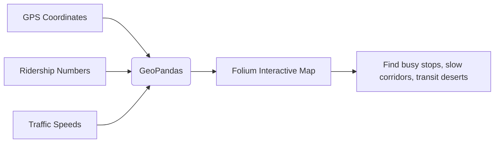

**Example:**
On the sample data, the map shows stop 2 as the largest red circle (485 riders), a candidate for more frequent buses. Stops 1 and 5 are small green circles (about 150 riders each), candidates for a merged route.

**Core Implementation Snippet** (from `18.py`):
```python
# Spatial join: keep only the stops that fall inside the city boundary
stops = gpd.sjoin(stops, city_map[['geometry']], how='inner', predicate='within').drop(columns='index_right')

# Iterate through data and add circles to the map
for idx, row in stops.iterrows():
    folium.CircleMarker(
        location=[row.geometry.y, row.geometry.x],
        radius=5 + 20 * row['ridership'] / stops['ridership'].max(),  # Size represents ridership
        popup=f"Stop: {row['stop_id']}<br>Ridership: {row['ridership']}",
        color=get_color(row['ridership']),  # Colour shows how busy the stop is
        fill=True,
        fill_opacity=0.7
    ).add_to(bus_map)
```

**Result when run:** the script lists the 5 stops inside the city boundary, busiest first, and saves `bus_ridership_map.html`. Open that file in a browser. The sample data is a made-up city with 5 stops and has no traffic data, so Step 4 is not in the script.

---

## 19. Predictive Maintenance System
**Question:** You are tasked with developing a predictive maintenance system for a manufacturing plant that relies heavily on automated machinery. The data available includes machine operational parameters, maintenance history, and failure incidents. What steps would you take to develop a predictive model, and can you provide a sample Python code snippet to illustrate how you might preprocess data and train a model for this purpose?

**Answer:**
The goal is to predict a failure early enough for the maintenance team to act before the machine breaks.

**Step 1: Time-Series Feature Engineering**
Create rolling averages and rolling standard deviations of the sensor data (e.g., vibration over the last 3 hours).

**Step 2: Maintenance History**
Join the maintenance log to the sensor data and add features such as "hours since the last service". Use the most recent service *before* each reading.

**Step 3: Label Generation**
Instead of predicting whether a machine is broken *now*, shift the target to predict whether it will break *in the next 24 hours*.

**Step 4: Modeling & Alerting**
Train an **XGBoost** or **Random Forest** classifier, test it on the most recent part of the timeline, and choose the alert threshold from the costs: a missed failure usually costs far more than a false alarm.

**🔥 Pro Tip / Common Pitfall (Look-ahead Bias):**
A rolling window must end at the prediction time. If it includes data from the future (for example a centered moving average), the model looks perfect in testing and fails in production. With many machines, also compute the rolling features per machine (`groupby('machine_id')`), otherwise one machine's readings leak into another machine's window.

**Visual Diagram:**
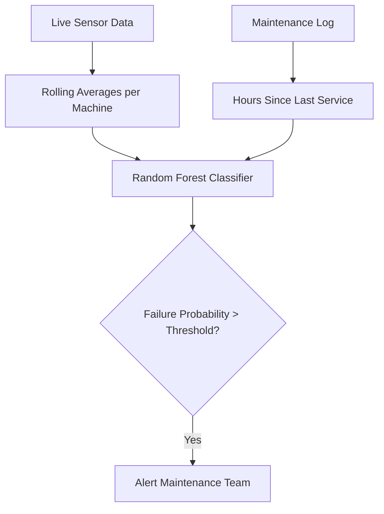

**Example:**
In a bottling plant, an unplanned stop costs far more per hour than a planned bearing replacement. With 24 hours of warning, the repair moves to a scheduled break. Because a missed failure is so much more expensive than a false alarm, the plant sets the alert threshold low.

**Core Implementation Snippet** (from `19.py`):
```python
# 1. Feature Engineering: Rolling Statistics (3h and 12h windows)
df['vib_mean_3h'] = df['vibration'].rolling(window=3).mean()
df['vib_std_12h'] = df['vibration'].rolling(window=12).std()

df['temp_mean_3h'] = df['temperature'].rolling(window=3).mean()
df['temp_max_12h'] = df['temperature'].rolling(window=12).max()

# 2. Maintenance History: hours since the most recent service BEFORE each reading
df = pd.merge_asof(df, maintenance_log, left_on='timestamp', right_on='maintenance_time', direction='backward')
df['hours_since_maintenance'] = (df['timestamp'] - df['maintenance_time']).dt.total_seconds() / 3600
df = df.drop(columns='maintenance_time')

# 3. Label Generation: Predict if a failure will happen in the *next 24 hours*
# We shift the failure column backwards.
# If any of the next 24 hours has a failure, label the current hour as 1.
df['failure_in_next_24h'] = df['failure'].rolling(window=24, min_periods=1).max().shift(-24)
```

**Result when run** (10,000 hours of synthetic data, tested on the last 20%): 86% of the alerts are real (precision) and 68% of the at-risk hours are flagged (recall).

---

## 20. Personalized Content Recommendations
**Question:** You are tasked with developing a machine learning model to personalize content recommendations for users on a media streaming platform. The data available includes user demographic details, viewing history, and ratings. What steps would you take to build a model for personalized recommendations, and can you provide a sample Python code snippet to illustrate how you might preprocess data and train a model for this purpose?

**Answer:**
The idea is collaborative filtering: recommend what similar users liked.

**Step 1: User-Item Matrix**
Convert the viewing history and ratings into a grid of Users vs. Movies. Most cells are empty, because nobody watches everything.

**Step 2: Collaborative Filtering**
Use **Matrix Factorization (Truncated SVD)** to discover latent (hidden) tastes, e.g., that a user likes Sci-Fi, without any genre tags. First subtract each user's average rating, so an empty cell means "no opinion" instead of "hated it".

**Step 3: Evaluate**
Hide 20% of the ratings, predict them, and compare the error (RMSE) with a baseline. In production, confirm with an A/B test on watch time.

**Step 4: Recommendation**
For a user, predict the rating of every unseen movie, sort the predictions, and recommend the Top 5.

**Step 5: Cold Start & Demographics**
A new user has no history. Use the demographic details (what is popular in the same age group or country) until the user has rated a few titles. For a new movie, use its content features such as genre.

**🔥 Pro Tip / Common Pitfall (Real Data Is Sparse):**
On a real platform a user watches far less than 1% of the catalog, and most signals are implicit (watch time, not ratings). A dense table from `pivot` will not fit in memory. Use sparse matrices and a library such as `implicit` (ALS), which learns only from the interactions that happened.

**Visual Diagram:**
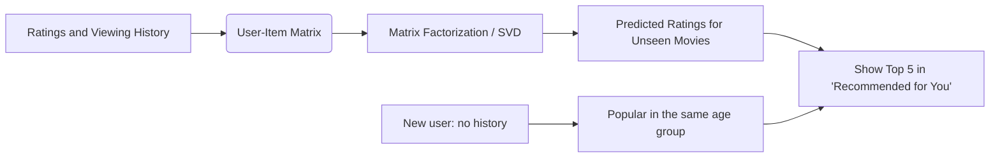

**Example:**
A user who gave 5 stars to "Inception" and "The Matrix" gets "Interstellar", because other users who liked those two also liked it. No genre tags are needed.

**Core Implementation Snippet** (from `20.py`):
```python
# 1. Create the User-Item Matrix (rows: users, columns: movies, values: ratings)
user_item_matrix = ratings_df.pivot(index='user_id', columns='movie_id', values='rating')

# 2. Centre each user's ratings on their own average, so that 0 means "no opinion".
#    (Filling the raw matrix with 0 would tell the model that unseen movies are hated.)
user_means = user_item_matrix.mean(axis=1)
centred = user_item_matrix.sub(user_means, axis=0)
is_rated = centred.notna().to_numpy()
known_values = centred.fillna(0).to_numpy()

# 3. Apply Matrix Factorization (Truncated SVD) to find latent (hidden) taste features.
#    Start with 0 in the empty cells, then replace those guesses with the model's own
#    predictions and refit a few times.
svd = TruncatedSVD(n_components=n_components, random_state=42)
filled = known_values.copy()
for _ in range(n_iterations):
    latent_matrix = svd.fit_transform(filled)
    reconstructed_matrix = np.dot(latent_matrix, svd.components_)
    filled = np.where(is_rated, known_values, reconstructed_matrix)

# 4. Add the averages back to get predicted ratings on the 1-5 scale for ALL user-movie pairs
predicted_ratings_df = pd.DataFrame(
    reconstructed_matrix + user_means.to_numpy()[:, None],
    index=user_item_matrix.index,
    columns=user_item_matrix.columns
).clip(1, 5)
```

**Result when run** (300 users, 60 movies): on hidden ratings the model's error (RMSE) is 0.93, against 1.09 for always predicting the user's average. A user whose top ratings are Horror gets four Horror movies first, in rank order. A new 50-year-old user gets Comedy and Drama, the favorites of that age group.
