# Data Science Questions and Answers

## 1. Handling Missing Data (30% missing)
**Question:** Imagine you're given a dataset where 30% of the data for a key predictive variable is missing. The variable is crucial for your predictive model. How would you handle this situation to ensure the integrity and performance of your model?

**Answer:** 
When 30% of a crucial variable is missing, simply deleting the rows isn't ideal because you lose a significant portion of your dataset. My step-by-step approach would be:
1. **Analyze the missingness:** Understand *why* it's missing. Is it completely at random (MCAR), at random (MAR), or not at random (MNAR)? 
2. **Imputation Strategy:** Since 30% is a lot but the feature is crucial, I would use an advanced imputation technique like **KNN (K-Nearest Neighbors) Imputation** or **Multiple Imputation by Chained Equations (MICE)**. These methods use other variables to predict and fill in the missing values accurately.
3. **Add a missing indicator:** I would create a new binary column (e.g., `is_missing`) to flag the imputed rows. Sometimes the *fact* that data was missing is itself predictive.

**🔥 Pro Tip / Common Pitfall (Data Leakage):** Never fit an imputer (like KNN or Mean) on your entire dataset before splitting it. You must split your data into train/test first, and only `.fit()` the imputer on the training data. Applying it to the whole dataset leaks information from the test set into your training process, artificially inflating your model's performance.

**Visual Diagram:**
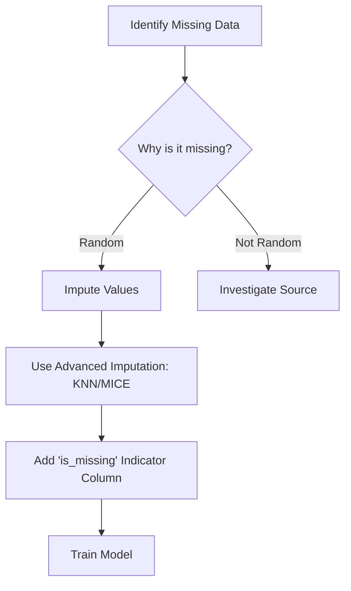

**Example:**
Imagine a housing dataset where 30% of "Square Footage" is missing. Instead of guessing the average, we look at the house's "Number of Bedrooms" and "Neighborhood" (using KNN) to estimate the missing square footage much more accurately.

**Python Code Example:**
```python
import pandas as pd
import numpy as np
from sklearn.impute import KNNImputer

# Sample data
data = {'Bedrooms': [3, 4, 2, 4, 3, 5],
        'Neighborhood_Rating': [8, 9, 5, 8, 7, 9],
        'SqFt': [1500, 2000, np.nan, 2100, np.nan, 3000]}
df = pd.DataFrame(data)

# 1. Add missing indicator
df['SqFt_missing'] = df['SqFt'].isnull().astype(int)

# 2. KNN Imputation
imputer = KNNImputer(n_neighbors=2)
imputed_data = imputer.fit_transform(df[['Bedrooms', 'Neighborhood_Rating', 'SqFt']])
df['SqFt'] = imputed_data[:, 2] # Update missing column with imputed values

print(df)
```

---

## 2. Handling Overfitting
**Question:** You've developed a predictive model, but you suspect it might be overfitting the training data. How would you test and address this issue?

**Answer:**
Overfitting happens when a model memorizes the training data, capturing the noise instead of the underlying pattern, which makes it perform poorly on new, unseen data.
1. **Test for Overfitting:** I would split the data into training, validation, and test sets, or use **k-fold cross-validation**. If the model shows high accuracy on the training data but low accuracy on the validation/test data, it is overfitting.
2. **Address Overfitting (Regularization & Early Stopping):** I would simplify the model by adding penalties (like L1/L2 regularization), reducing the number of features, or getting more training data. For Deep Learning, **Early Stopping** (halting training when validation error starts to rise) and Dropout are critical.

**Visual Diagram:**
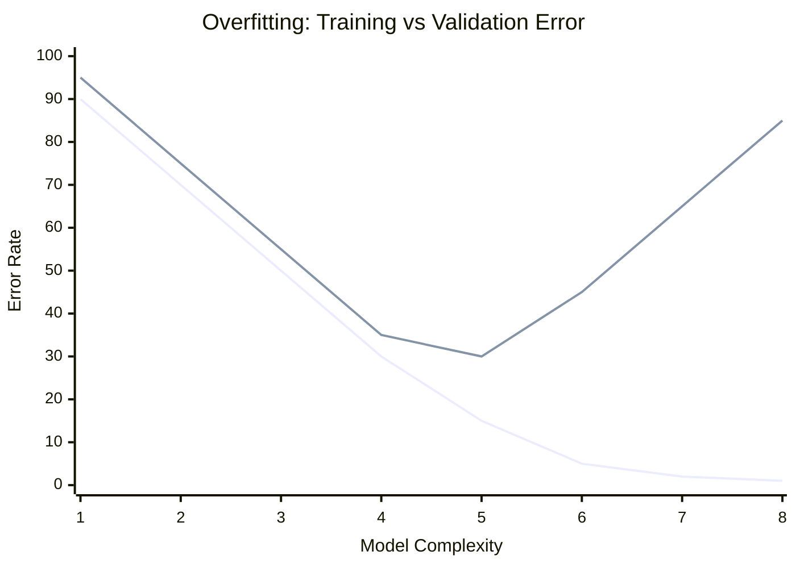
*(The gap between training and validation error increases as complexity grows—this is overfitting).*

**Example:**
If a student memorizes the exact questions on a practice math test instead of learning the formulas, they will score 100% on the practice test (training) but fail the real exam (validation). 

**Python Code Example:**
```python
from sklearn.model_selection import train_test_split
from sklearn.ensemble import RandomForestClassifier
from sklearn.metrics import accuracy_score
from sklearn.datasets import make_classification

# Generate mock data
X, y = make_classification(n_samples=1000, n_features=20, random_state=42)

# 1. Split data to test for overfitting
X_train, X_test, y_train, y_test = train_test_split(X, y, test_size=0.2, random_state=42)

# 2. Address overfitting by limiting max_depth (Regularization)
# A very deep tree will overfit; max_depth=5 prevents it.
model = RandomForestClassifier(max_depth=5, random_state=42) 
model.fit(X_train, y_train)

train_acc = accuracy_score(y_train, model.predict(X_train))
test_acc = accuracy_score(y_test, model.predict(X_test))

print(f"Training Accuracy: {train_acc:.2f}")
print(f"Test Accuracy: {test_acc:.2f}")
```

---

## 3. Real-time Stock Prediction System
**Question:** You are tasked with building a model to predict stock prices in real-time. Describe how you would set up your system to handle this type of data effectively.

**Answer:**
A real-time stock prediction system requires processing streams of data with extremely low latency, coupled with robust financial modeling.
1. **Ingestion & Processing:** I would use a distributed messaging system like **Apache Kafka** and a stream processor like **Apache Flink** to ingest stock ticks and compute order-book imbalances in real-time.
2. **Modeling & Backtesting:** Standard ML models often fail in finance due to the Efficient Market Hypothesis. The model must be strictly evaluated using a specialized **Backtesting Engine** that accounts for transaction costs and market slippage, not just standard accuracy metrics.
3. **Prediction:** Features are passed to a pre-trained ML model served via an ultra-fast API (e.g., FastAPI or gRPC).

**Visual Diagram:**
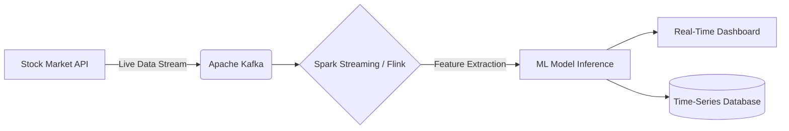

**Example:**
It's like a live sports commentator. As the game happens (data streaming in via Kafka), the commentator analyzes the play instantly (Spark Streaming) and predicts what the team will do next (ML Model).

**Python Code Example:**
```python
# Conceptual example using Kafka-Python and a mock ML model
from kafka import KafkaConsumer
import json

# Setup Kafka Consumer to listen to stock stream
consumer = KafkaConsumer('live_stock_ticks', bootstrap_servers='localhost:9092',
                         value_deserializer=lambda m: json.loads(m.decode('utf-8')))

def predict_stock(price_data):
    # Mock prediction logic
    moving_average = sum(price_data) / len(price_data)
    return "BUY" if price_data[-1] > moving_average else "SELL"

price_history = []

# Listen to real-time stream
for message in consumer:
    tick = message.value
    price_history.append(tick['price'])
    
    # Keep only the last 10 ticks for prediction
    if len(price_history) > 10:
        price_history.pop(0)
        prediction = predict_stock(price_history)
        print(f"Ticker: {tick['symbol']} | Price: {tick['price']} | Action: {prediction}")
```

---

## 4. Scaling Data Analysis (10x Volume)
**Question:** Given a scenario where your organization suddenly needs to scale its data analysis capabilities due to an influx of data (10x normal volume), how would you handle this?

**Answer:**
A 10x sudden increase in data volume requires transitioning from vertical scaling (upgrading one big machine) to horizontal scaling (distributing work across many machines).
1. **Storage:** Move data to a scalable cloud object storage like **Amazon S3** or **Google Cloud Storage**.
2. **Compute Engine:** Transition from Pandas (which runs on a single machine's RAM) to distributed computing frameworks like **Apache Spark** or **Dask**.
3. **Data Warehouse:** Utilize a serverless data warehouse like **BigQuery** or **Snowflake** to handle complex analytical queries efficiently across terabytes of data.

**🔥 Pro Tip / Common Pitfall (Distributed Overhead):** Distributed systems like Spark come with massive network and serialization overhead. A common mid-level mistake is using Spark for small datasets (e.g., 10GB). For anything under 100GB, vertical scaling (simply renting a larger cloud VM with massive RAM and using Pandas or Polars) is usually much faster and cheaper.

**Visual Diagram:**
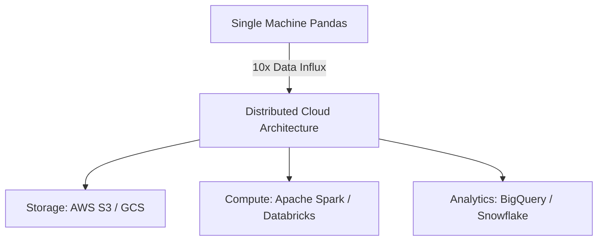

**Example:**
If a bakery suddenly gets 10 times more cake orders, hiring one very fast baker (vertical scaling) won't work. You need to hire 10 bakers and split the tasks among them (horizontal scaling with Spark).

**Python Code Example:**
```python
# Using PySpark to handle massive data instead of Pandas
from pyspark.sql import SparkSession
from pyspark.sql.functions import col

# Initialize a Spark session (distributes workloads across a cluster)
spark = SparkSession.builder.appName("DataScale").getOrCreate()

# Load massive dataset (10x volume) from Cloud Storage
# Spark evaluates lazily, so it doesn't crash memory
df = spark.read.csv("s3a://massive-data-bucket/transactions_*.csv", header=True, inferSchema=True)

# Perform distributed aggregation
sales_summary = df.groupBy("product_id").sum("revenue")

# Bring only the small summary back to the driver node
sales_summary.show(5)
```

---

## 5. Deploying ML Model to Production
**Question:** What steps would you take to ensure the successful deployment and operation of a machine learning model in production?

**Answer:**
Deploying a model safely is a core part of MLOps. 
1. **Containerization:** I would package the model and its dependencies into a **Docker** container to ensure it runs consistently anywhere.
2. **Safe Rollout (Canary/Shadow Deployment):** Before fully replacing an old system, I would deploy the model in **Shadow Mode** (processing live traffic but not impacting users) or as a **Canary Release** (routing 5% of traffic to the new model) to safely test its real-world performance.
3. **Monitoring & Observability:** Once fully deployed, I would set up monitoring tools (like Prometheus/Grafana) to track **data drift**, prediction latency, and system health to know exactly when the model requires retraining.

**Visual Diagram:**
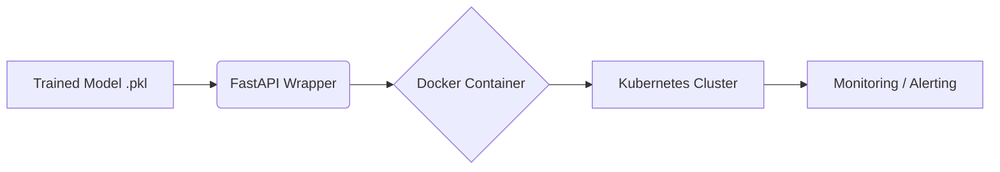

**Example:**
Building the model is like cooking a recipe. Deploying it is like opening a restaurant: you need a standardized kitchen (Docker), waiters to take orders (API), and a manager to ensure food quality stays high over time (Monitoring).

**Python Code Example:**
```python
# Basic FastAPI setup to serve a trained model
from fastapi import FastAPI
from pydantic import BaseModel
import pickle

app = FastAPI()

# Load a pre-trained model (mock)
# with open("model.pkl", "rb") as f:
#     model = pickle.load(f)

class RequestData(BaseModel):
    feature1: float
    feature2: float

@app.post("/predict")
def predict(data: RequestData):
    # In reality: prediction = model.predict([[data.feature1, data.feature2]])
    prediction = (data.feature1 + data.feature2) * 1.5 # Mock logic
    return {"prediction": prediction}

# Run with: uvicorn script_name:app --host 0.0.0.0 --port 8000
```

---

## 6. Shift to Data-Driven Decision Making
**Question:** Your company wants to shift towards more data-driven decision-making. What steps would you take to develop a strategy for this?

**Answer:**
Shifting to data-driven decision-making is as much a cultural shift as a technical one.
1. **Data Centralization & Democratization:** Create a single source of truth (a Data Warehouse) and implement BI tools (Tableau, Looker) so non-technical staff can access dashboards easily.
2. **Data Literacy:** Train employees across departments on how to read dashboards and interpret basic metrics.
3. **KPI Alignment:** Ensure that every department's goals are tied to measurable, tracked data points. 
**Challenges:** Resistance to change and dirty data are the biggest hurdles. I would address this by starting with small, highly visible "quick win" projects to build trust in the data.

**Visual Diagram:**
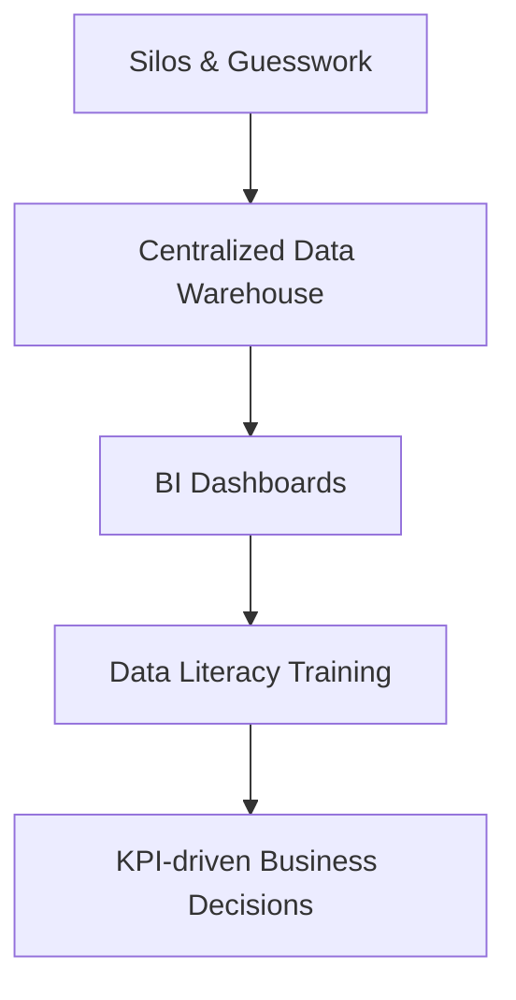

**Example:**
Instead of the Marketing Director deciding to run an ad campaign because it "feels right," they look at a dashboard showing that users aged 18-24 have the highest ROI, and target the campaign purely based on those numbers.

**Python Code Example:**
```python
# A simple script to automate a daily KPI report to encourage data usage
import pandas as pd

def generate_daily_report():
    # Load data from the centralized warehouse
    # df = pd.read_sql("SELECT * FROM daily_sales", connection)
    
    # Mock data
    data = {'Department': ['Sales', 'Marketing', 'Support'], 'Score': [85, 92, 78]}
    df = pd.DataFrame(data)
    
    report = "DAILY KPI REPORT\n"
    report += "-"*20 + "\n"
    for index, row in df.iterrows():
        report += f"{row['Department']} Performance: {row['Score']}/100\n"
        
    print(report)
    # In reality, you'd email this to stakeholders or push to Slack
    
generate_daily_report()
```

---

## 7. Analyzing Extremely Large Datasets (Terabytes)
**Question:** Your project involves analyzing extremely large datasets, potentially exceeding terabytes in size. What strategies would you use?

**Answer:**
You cannot load a terabyte of data into a standard laptop's memory.
1. **Distributed Computing:** I would use **Apache Spark**, which splits the terabyte dataset into smaller chunks and processes them in parallel across a cluster of computers.
2. **Columnar Storage:** I would store the data in a columnar format like **Parquet** or **ORC**. These formats compress highly and allow analytical queries to read only the specific columns they need, drastically reducing I/O.
3. **Cloud Data Warehouses:** For SQL analytics, I would use **Google BigQuery**, which distributes queries across thousands of cloud servers automatically.

**Visual Diagram:**
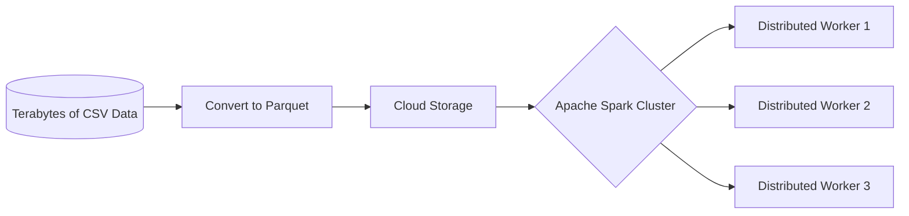

**Example:**
Reading a 1TB CSV is like reading an entire library book-by-book to find a specific quote. Using Parquet with Spark is like having an index and 100 assistants looking for the quote simultaneously.

**Python Code Example:**
```python
# Reading massive datasets efficiently using PySpark and Parquet
from pyspark.sql import SparkSession

spark = SparkSession.builder.appName("TerabyteAnalysis").getOrCreate()

# Reading a highly optimized Parquet file instead of CSV
df = spark.read.parquet("s3a://data-lake/massive_dataset.parquet")

# Using SQL-like syntax to filter at scale
# Spark optimizes the execution plan under the hood
high_value_users = df.filter(df.total_spent > 1000).select("user_id", "email")

# Write results back out to distributed storage
# high_value_users.write.parquet("s3a://data-lake/high_value_users.parquet")
```

---

## 8. Diagnosing an Underperforming Model
**Question:** During model development, you've noticed that your machine learning model is underperforming. What steps would you take to diagnose the problem and optimize it?

**Answer:**
When a model underperforms, I systematically debug the data, the features, and the algorithm.
1. **Analyze Learning Curves:** I would plot training and validation error against dataset size. If both errors are high, the model has **High Bias** (underfitting; needs more complexity). If the gap between them is huge, it has **High Variance** (overfitting; needs regularization or more data).
2. **Check Data & Errors:** Look at the confusion matrix for class imbalance or review the top false positives to see if the data contains mislabeled noise.
3. **Feature Engineering & Hyperparameters:** Create new features that capture the relationships better, then use **Grid Search** or **Random Search** to find optimal hyperparameters.

**Visual Diagram:**
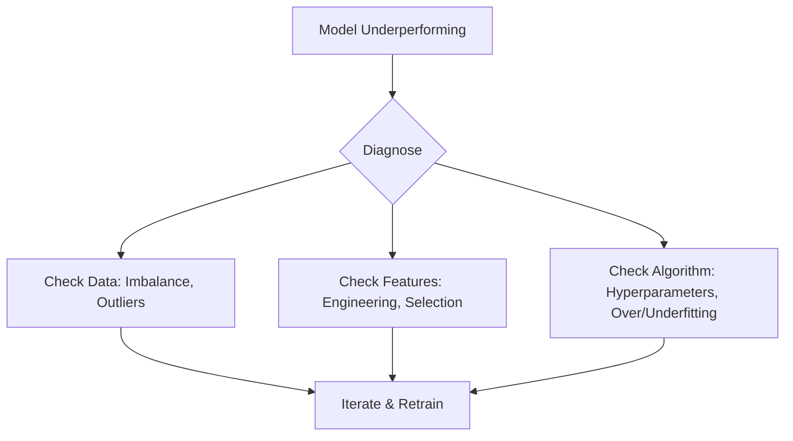

**Example:**
If a car is driving poorly, you don't just buy a new car. You check the tires (data quality), the steering alignment (features), and then tune the engine (hyperparameters).

**Python Code Example:**
```python
# Optimizing a model using GridSearchCV to find the best hyperparameters
from sklearn.ensemble import RandomForestClassifier
from sklearn.model_selection import GridSearchCV
from sklearn.datasets import make_classification

X, y = make_classification(n_samples=500, random_state=42)

# Base model
rf = RandomForestClassifier(random_state=42)

# Define the hyperparameters to tune
param_grid = {
    'n_estimators': [50, 100, 200],
    'max_depth': [None, 5, 10],
    'min_samples_split': [2, 5]
}

# Grid Search will test every combination
grid_search = GridSearchCV(estimator=rf, param_grid=param_grid, cv=3, scoring='accuracy')
grid_search.fit(X, y)

print(f"Best Parameters found: {grid_search.best_params_}")
print(f"Optimized Accuracy: {grid_search.best_score_:.2f}")
```

---

## 9. Managing Unstructured Data (Text, Images, Videos)
**Question:** You are given a large volume of unstructured data including text, images, and videos. What strategies would you use to manage and analyze this?

**Answer:**
Unstructured data doesn't fit neatly into rows and columns, so it requires specialized storage and deep learning for extraction.
1. **Storage & Embeddings:** I would store raw files in a Data Lake (AWS S3). More importantly, I would convert the unstructured text and images into dense numerical vectors (embeddings) and store them in a **Vector Database** (like Pinecone or Milvus).
2. **Analysis (Text):** I would utilize a **RAG (Retrieval-Augmented Generation)** architecture with LLMs, querying the Vector DB to give the LLM context to extract insights, entities, and sentiment from massive document stores.
3. **Analysis (Images/Video):** Use pre-trained models (like YOLO or ResNet via PyTorch) to extract features, detect objects, or generate image embeddings for similarity search.

**Visual Diagram:**
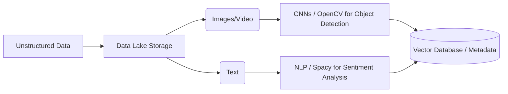

**Example:**
A self-driving car analyzes a continuous video stream (unstructured data). It uses computer vision to draw boxes around pedestrians and text on stop signs, converting unstructured pixels into structured rules.

**Python Code Example:**
```python
# Example: Basic text and image unstructured data processing
import cv2
import spacy
import numpy as np

# 1. Text Analysis (NLP)
# nlp = spacy.load("en_core_web_sm")
# doc = nlp("Apple is opening a new store in London.")
# for ent in doc.ents:
#     print(f"Entity: {ent.text}, Label: {ent.label_}")

# 2. Image Analysis (OpenCV)
# Create a dummy image (black square)
img = np.zeros((512, 512, 3), dtype=np.uint8)

# Convert to grayscale (common preprocessing step for images)
gray_image = cv2.cvtColor(img, cv2.COLOR_BGR2GRAY)
print(f"Processed image shape: {gray_image.shape}")
```

---

## 10. Scaling AI Operations Enterprise-Wide
**Question:** Your company wants to scale its AI operations from a few initial pilot projects to enterprise-wide implementation. What are the key considerations and steps?

**Answer:**
Scaling AI requires moving from "jupyter notebooks" to standardized engineering practices.
1. **MLOps & Feature Stores:** Implement strict MLOps using **MLflow** or **Kubeflow** for experiment tracking. I would also deploy a **Feature Store** (like Feast) so all data science teams can reuse engineered features, ensuring consistency between training and production.
2. **Standardized Infrastructure:** Provide unified cloud infrastructure and CI/CD pipelines so every data scientist builds, tests, and deploys models the exact same way.
3. **Governance & Ethics:** Establish an AI review board to ensure enterprise models comply with regulations, are unbiased, and are securely handling customer data.

**Visual Diagram:**
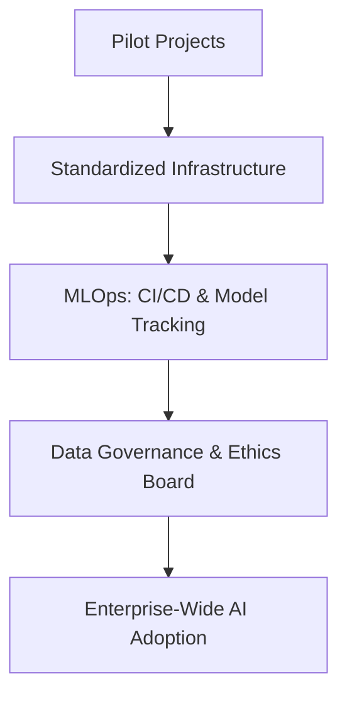

**Example:**
Moving from a home cook to a restaurant franchise. You need standard operating procedures, supply chains, and health inspections (MLOps and Governance) to ensure every meal is the same quality across 100 locations.

**Python Code Example:**
```python
# Using MLflow to standardize tracking across the enterprise
import mlflow
import mlflow.sklearn
from sklearn.linear_model import LogisticRegression

# Set up centralized tracking server (simulated)
# mlflow.set_tracking_uri("http://enterprise-mlflow-server:5000")

# Start an experiment run
with mlflow.start_run(run_name="Enterprise_Churn_Model_v1"):
    model = LogisticRegression()
    # model.fit(X_train, y_train) # Mock training
    
    # Log parameters and metrics so everyone in the company can see them
    mlflow.log_param("regularization", "l2")
    mlflow.log_metric("accuracy", 0.89)
    
    # Save the model centrally
    # mlflow.sklearn.log_model(model, "model")
    print("Model logged to enterprise MLflow server.")
```

---

## 11. Ethical Considerations in Data Science
**Question:** In your data science projects, how do you ensure that ethical considerations are addressed? 

**Answer:**
Ethics in AI is critical to prevent harm, bias, and privacy violations.
1. **Bias & Fairness:** I actively test datasets for representational bias (e.g., ensuring equal representation across demographics) and use fairness metrics to evaluate model outcomes across different subgroups.
2. **Privacy:** I apply data anonymization or masking techniques (e.g., PII removal) before model training to protect user privacy.
3. **Explainability & Transparency:** I use tools like SHAP or LIME to explain *why* a model made a decision, ensuring it isn't a "black box" that operates on discriminatory logic.
4. **Frameworks:** I align my projects with established frameworks like the **EU's GDPR** or the **NIST AI Risk Management Framework**.

**Visual Diagram:**
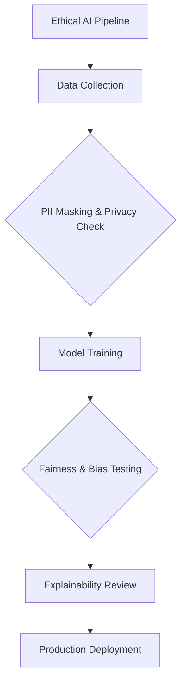

**Example:**
If building a resume-screening AI, I would remove names and genders to protect privacy, and then run tests to mathematically prove the model isn't secretly penalizing female candidates based on extracurricular activities (Bias testing).

**Python Code Example:**
```python
# A conceptual example of checking model fairness using Aequitas/Fairlearn concepts
import pandas as pd
from sklearn.metrics import accuracy_score

# Mock predictions and demographic data
data = {
    'Applicant_Group': ['Minority', 'Majority', 'Minority', 'Majority', 'Minority'],
    'Actual_Hired': [1, 1, 0, 1, 0],
    'Model_Predicted': [1, 1, 0, 1, 0]
}
df = pd.DataFrame(data)

# Calculate accuracy overall
overall_acc = accuracy_score(df['Actual_Hired'], df['Model_Predicted'])

# Calculate accuracy by demographic group to ensure fairness
for group in df['Applicant_Group'].unique():
    subset = df[df['Applicant_Group'] == group]
    acc = accuracy_score(subset['Actual_Hired'], subset['Model_Predicted'])
    print(f"Accuracy for {group}: {acc:.2f}")
    
# If the accuracy for Minority is significantly lower, the model is biased!
```

---

## 12. Forecasting Monthly Sales
**Question:** You are tasked with forecasting monthly sales for a retail company using time-series data from the past five years. What steps would you take?

**Answer:**
Time-series forecasting requires understanding patterns over time.
1. **Data Prep:** Resample the data to monthly frequency, handle missing dates, and check for stationarity (whether the mean and variance change over time).
2. **Decomposition:** I would split the time-series into three components: **Trend** (overall direction), **Seasonality** (repeating patterns like holiday spikes), and **Residuals** (random noise).
3. **Modeling:** For a 5-year dataset, I would use tools like **ARIMA** or Facebook's **Prophet**. Prophet is highly robust to missing data and handles seasonal effects (like Black Friday) exceptionally well.

**🔥 Pro Tip / Common Pitfall (Time-Series Validation):** Never use standard K-Fold cross-validation on time-series data. Standard K-Fold randomly shuffles data, which destroys the chronological sequence and causes data leakage (predicting the past using the future). Always use **Time-Series Split (Expanding Window)** validation instead.

**Visual Diagram:**
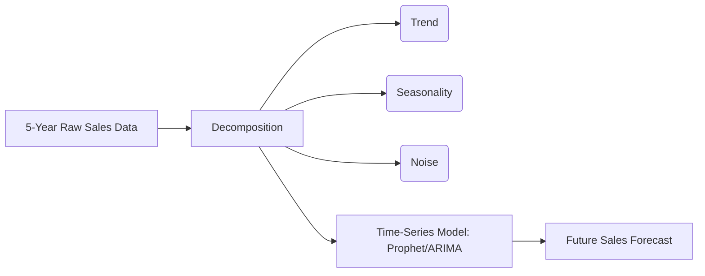

**Example:**
Analyzing ice cream sales: The *trend* might show sales increasing year over year, while the *seasonality* shows massive spikes every summer.

**Python Code Example:**
```python
# Forecasting with a time-series model (Conceptual Prophet implementation)
import pandas as pd
# from prophet import Prophet 

# 1. Prepare data (Prophet requires columns 'ds' for date and 'y' for value)
data = {'ds': ['2020-01-31', '2020-02-28', '2020-03-31'],
        'y': [10000, 11000, 15000]}
df = pd.DataFrame(data)

# 2. Initialize and train model
# model = Prophet(seasonality_mode='multiplicative')
# model.fit(df)

# 3. Predict the next 12 months
# future = model.make_future_dataframe(periods=12, freq='M')
# forecast = model.predict(future)
# print(forecast[['ds', 'yhat', 'yhat_lower', 'yhat_upper']].tail())
print("Data prepared for time-series modeling. (Requires Prophet library).")
```

---

> **Note on Practical Scenarios (Q13 - Q20):** 
> The Python implementations for the following questions have been provided as standalone `.py` scripts (`13.py` through `20.py`) in the project directory. Below are the theoretical answers, diagrams, and code snippets from those files.

---

## 13. Customer Segmentation (Clustering)
**Question:** Your task is to segment customers into distinct groups based on purchasing behavior and demographics. What steps would you take?

**Answer:**
This is an unsupervised learning problem.
1. **Data Prep:** I would handle missing values and, crucially, **scale the data** (using StandardScaler). Distance-based algorithms fail if one column is in millions (income) and another in single digits (age).
2. **Determine Clusters:** I would use the **Elbow Method** to find the optimal number of clusters ($k$).
3. **Clustering:** Apply **K-Means clustering** to group the customers, then analyze the average characteristics of each cluster to assign them business personas (e.g., "High-income bargain hunters").

**Visual Diagram:**
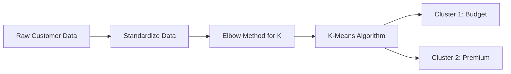
**Example:** Grouping shoppers at a mall based on how much they spend and their age.
*(Full Python implementation available in `13.py`)*

**Core Implementation Snippet:**
```python
# Applying K-Means Clustering
kmeans = KMeans(n_clusters=5, random_state=42) #Assuming 5 clusters based on the elbow method
clusters = kmeans.fit_predict(data_scaled)
data['Cluster'] = clusters
```

---

## 14. Customer Churn Prediction
**Question:** Develop a model to predict which customers are likely to churn from a subscription service.

**Answer:**
This is a binary classification problem.
1. **Feature Engineering:** Calculate metrics like "days since last login", "customer service tickets opened", and "monthly spend".
2. **Handle Imbalance:** Churn datasets are usually imbalanced (most don't churn). I would use techniques like **SMOTE** (Synthetic Minority Over-sampling) or class weights.
3. **Modeling:** Train a classification algorithm like **Logistic Regression** or **Random Forest**. Evaluate using **Precision, Recall, and the F1-Score** rather than pure accuracy.

**🔥 Pro Tip / Common Pitfall (Oversampling Leakage):** A highly common mistake is applying SMOTE to the entire dataset *before* the train/test split. SMOTE must **ONLY** be applied to the training set. If you oversample the test set, your evaluation metrics will be completely invalid because you are testing the model on synthetic, perfectly balanced data rather than the real-world imbalanced distribution.

**Visual Diagram:**
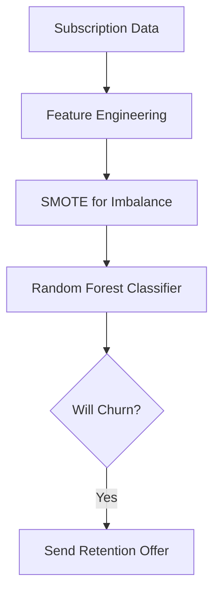
*(Full Python implementation available in `14.py`)*

**Core Implementation Snippet:**
```python
# Handle Imbalance with SMOTE
smote = SMOTE(random_state=42)
X_train_resampled, y_train_resampled = smote.fit_resample(X_train, y_train)

# Model Training (Random Forest)
model = RandomForestClassifier(n_estimators=100, random_state=42)
model.fit(X_train_resampled, y_train_resampled)
```

---

## 15. Sentiment Analysis using Deep Learning
**Question:** Develop a sentiment analysis model to understand customer opinions from reviews.

**Answer:**
1. **Text Preprocessing:** Convert the raw text to lowercase, remove punctuation, and tokenize the words.
2. **Word Embeddings:** Convert words into numerical vectors using pre-trained embeddings (like GloVe) or an embedding layer in the network.
3. **Deep Learning Model:** Use an **LSTM (Long Short-Term Memory)** network or a Transformer model. LSTMs are excellent for text because they remember the context of preceding words in a sentence.

**Visual Diagram:**
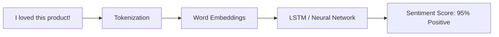
*(Full Python implementation using TensorFlow/Keras available in `15.py`)*

**Core Implementation Snippet:**
```python
# Build the LSTM model
model = Sequential([
    Embedding(input_dim=10000, output_dim=64, input_length=20),
    LSTM(64),
    Dense(32, activation='relu'),
    Dense(1, activation='sigmoid') # Binary classification for sentiment
])
model.compile(loss='binary_crossentropy', optimizer='adam', metrics=['accuracy'])
```

---

## 16. Anomaly Detection for Fraud
**Question:** Identify unusual transactions in financial data that might suggest fraudulent activity.

**Answer:**
1. **Data Prep:** Clean the financial data and scale the transaction amounts.
2. **Unsupervised Anomaly Detection:** Since we likely don't have labels for every fraud case, I would use an algorithm like **Isolation Forest**. 
3. **Evaluation:** The algorithm isolates data points; points that are isolated quickly (with few splits) are flagged as anomalies. We then review these flagged transactions manually.

**Visual Diagram:**
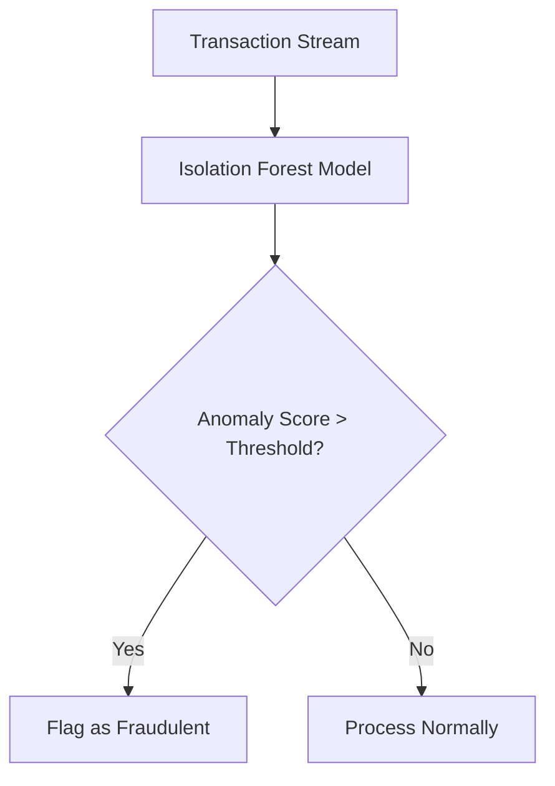
*(Full Python implementation available in `16.py`)*

**Core Implementation Snippet:**
```python
# 3. Apply Isolation Forest
model = IsolationForest(n_estimators=100, contamination=0.01, random_state=42)
df['anomaly_score'] = model.fit_predict(X_scaled)

# Isolate anomalies (-1 means anomaly, 1 means normal)
anomalies = df[df['anomaly_score'] == -1]
```

---

## 17. Real Estate Price Prediction (Web App Integration)
**Question:** How would you integrate a real estate price prediction model into a web application for real-time predictions?

**Answer:**
1. **Serialize Model:** Save the trained machine learning model to disk using `pickle` or `joblib`.
2. **API Development:** Create a backend API using **FastAPI** or **Flask**. The API will load the serialized model into memory.
3. **Endpoint Creation:** Create a `POST` endpoint that accepts JSON data (location, size, amenities) from the web frontend, passes it to the model, and returns the predicted price as a JSON response.

**Visual Diagram:**
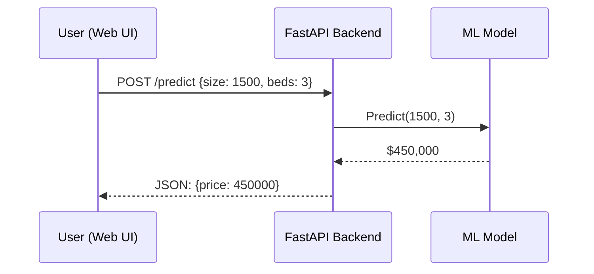
*(Full Python implementation available in `17.py`)*

**Core Implementation Snippet:**
```python
app = FastAPI()
model = joblib.load('real_estate_model.pkl') # Load pre-trained model

@app.post("/predict")
def predict_price(data: PropertyData):
    # Convert input to DataFrame for the model
    features = pd.DataFrame([data.dict()])
    prediction = model.predict(features)
    return {"predicted_price": float(prediction[0])}
```

---

## 18. Geospatial Data Analysis (Public Transport)
**Question:** Analyze geospatial data to help a city improve its public transportation system.

**Answer:**
1. **Spatial Joining:** Use a library like **GeoPandas** to map GPS coordinates of bus stops to specific city neighborhoods or zones.
2. **Density Analysis:** Overlay ridership numbers onto the map to identify "hotspots" (high demand areas).
3. **Visualization:** Use **Folium** to generate interactive HTML maps showing bus stop markers sized/colored based on traffic volume, allowing city planners to visually see where new routes are needed.

**Visual Diagram:**
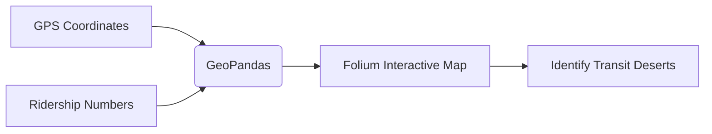
*(Full Python implementation available in `18.py`)*

**Core Implementation Snippet:**
```python
# Iterate through data and add circles to the map
for idx, row in df.iterrows():
    folium.CircleMarker(
        location=[row['lat'], row['lon']],
        radius=row['ridership'] / 100, # Size represents ridership
        popup=f"Stop: {row['stop_id']}<br>Ridership: {row['ridership']}",
        color=get_color(row['ridership']), # Colors based on density
        fill=True,
        fill_opacity=0.7
    ).add_to(city_map)
```

---

## 19. Predictive Maintenance System
**Question:** Develop a predictive maintenance system for a manufacturing plant based on operational parameters and maintenance history.

**Answer:**
1. **Time-Series Feature Engineering:** Create rolling averages and rolling standard deviations for sensor data (e.g., vibration over the last 3 hours).
2. **Label Generation:** Instead of predicting if a machine is broken *now*, shift the target variable to predict if it will break *in the next 24 hours*.
3. **Modeling:** Train an **XGBoost** or **Random Forest** classifier on these rolling features to predict the impending failure, allowing maintenance to act before it breaks.

**🔥 Pro Tip / Common Pitfall (Look-ahead Bias):** When creating rolling features (like a 3-hour moving average), you must ensure the mathematical window strictly closes *before* the prediction timestamp. If your window accidentally includes data from the future (e.g., using a centered moving average), your model suffers from look-ahead bias and will fail instantly in production.

**Visual Diagram:**
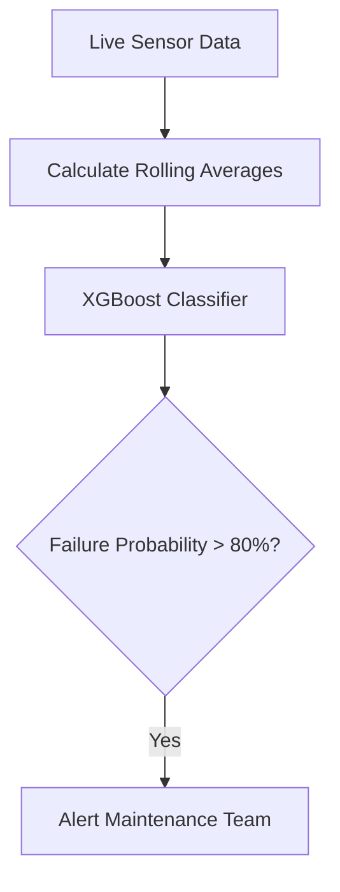
*(Full Python implementation available in `19.py`)*

**Core Implementation Snippet:**
```python
# Feature Engineering: Rolling Statistics (3h and 12h windows)
df['vib_mean_3h'] = df['vibration'].rolling(window=3).mean()
df['temp_max_12h'] = df['temperature'].rolling(window=12).max()

# Label Generation: Predict if a failure will happen in the *next 24 hours*
df['failure_in_next_24h'] = df['failure'].rolling(window=24, min_periods=1).max().shift(-24)
```

---

## 20. Personalized Content Recommendations
**Question:** Develop a machine learning model to personalize content recommendations for users on a media streaming platform.

**Answer:**
1. **User-Item Matrix:** Convert user viewing history and ratings into a massive grid of Users vs. Movies.
2. **Collaborative Filtering:** Use **Matrix Factorization (Truncated SVD)** to discover latent (hidden) relationships between users and content (e.g., automatically identifying a user likes "Sci-Fi" based on math, without tags).
3. **Recommendation:** For a specific user, predict their rating for all unseen movies using the matrix, sort the predictions, and recommend the Top 5.

**Visual Diagram:**
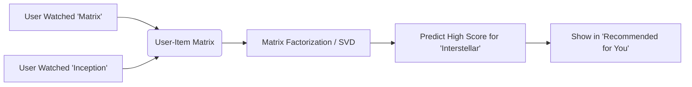
*(Full Python implementation available in `20.py`)*

**Core Implementation Snippet:**
```python
# 1. Create the User-Item Matrix
user_item_matrix = ratings_df.pivot(index='user_id', columns='movie_id', values='rating').fillna(0)

# 2. Apply Matrix Factorization (Truncated SVD)
svd = TruncatedSVD(n_components=10, random_state=42)
latent_matrix = svd.fit_transform(user_item_matrix)

# Reconstruct the matrix to get predicted ratings for ALL user-movie pairs
reconstructed_matrix = np.dot(latent_matrix, svd.components_)
```

